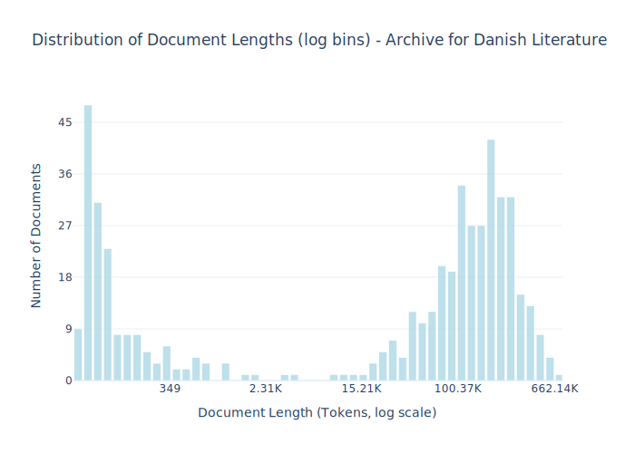

# Dataset Card for Archive for Danish Literature

## Dataset Description

<!-- START-SHORT DESCRIPTION -->
Danish literature from 1700-2023 from the [Archive for Danish Literature](https://tekster.kb.dk/text?editorial=no&f%5Bsubcollection_ssi%5D%5B%5D=adl&match=one&search_field=Alt) (ADL).
<!-- END-SHORT DESCRIPTION -->

Archive for Danish Literature (ADL) is a literary-historical collection of selected parts of older Danish literature, from the Middle Ages up to the mid-20th century.
It provides access to both the texts and introductory material on most of the authors. ADL is a resource for research, teaching, and broad dissemination of older Danish
literature. Currently, ADL contains works by 78 authors. The texts are reproduced from standard printed editions. All texts are searchable, and many can also be viewed as facsimiles (photographs of the original edition) 
on the Danish Royal Library's [website](https://tekster.kb.dk/text?editorial=no&f%5Bsubcollection_ssi%5D%5B%5D=adl&match=one&search_field=Alt). 

See also dataset [entry](https://sprogteknologi.dk/dataset/public-adl-text-sources) on sprogteknologi.dk and an [API](https://rawgit.com/Det-Kongelige-Bibliotek/access-digital-objects/master/form-demos/adl-form.html).

<!-- START-DESC-STATS -->
- **Number of samples**: 498
- **Number of tokens (Llama 3)**: 58.49M
- **Average document length in tokens (min, max)**: 117.46K (53, 662.14K)
<!-- END-DESC-STATS -->


## Dataset Structure
An example from the dataset looks as follows.


<!-- START-SAMPLE -->
```py
{
  "id": "adl_aakjaer06val",
  "text": "SAMLEDE VÆRKER\n\nJEPPE AAKJÆR GYLDENDALSKE BOGHANDEL - NORDISK FORLAG KJØBENHAVN OG\nKRISTIANIA 1919 0[...]",
  "source": "adl",
  "added": "2020-09-14",
  "created": "1700-01-01, 2022-01-01",
  "token_count": 439908
}
```

### Data Fields

An entry in the dataset consists of the following fields:

- `id` (`str`): An unique identifier for each document.
- `text`(`str`): The content of the document.
- `source` (`str`): The source of the document.
- `added` (`str`): An date for when the document was added to this collection.
- `created` (`str`): An date range for when the document was originally created.
- `token_count` (`int`): The number of tokens in the sample computed using the Llama 8B tokenizer
<!-- END-SAMPLE -->


### Dataset Statistics

<!-- START-DATASET PLOTS -->
<p align="center">

</p>
<!-- END-DATASET PLOTS -->


## Additional Information


### Citation Information

This dataset was initially published as part of the [Danish gigaword](https://huggingface.co/danish-foundation-models). We recommend that you cite and reference it if you use this dataset:

> Derczynski, L., Ciosici, M. R., et al. (2021). The Danish Gigaword Corpus. In Proceedings of the 23rd Nordic Conference on Computational Linguistics (NoDaLiDa 2021).

```bash
@inproceedings{dagw,
 title = {{The Danish Gigaword Corpus}},
 author = {Leon Derczynski and Manuel R. Ciosici and Rebekah Baglini and Morten H. Christiansen and Jacob Aarup Dalsgaard and Riccardo Fusaroli and Peter Juel Henrichsen and Rasmus Hvingelby and Andreas Kirkedal and Alex Speed Kjeldsen and Claus Ladefoged and Finn Årup Nielsen and Jens Madsen and Malte Lau Petersen and Jonathan Hvithamar Rystrøm and Daniel Varab},
 year = 2021,
 booktitle = {Proceedings of the 23rd Nordic Conference on Computational Linguistics},
 publisher = {NEALT}
}
```
