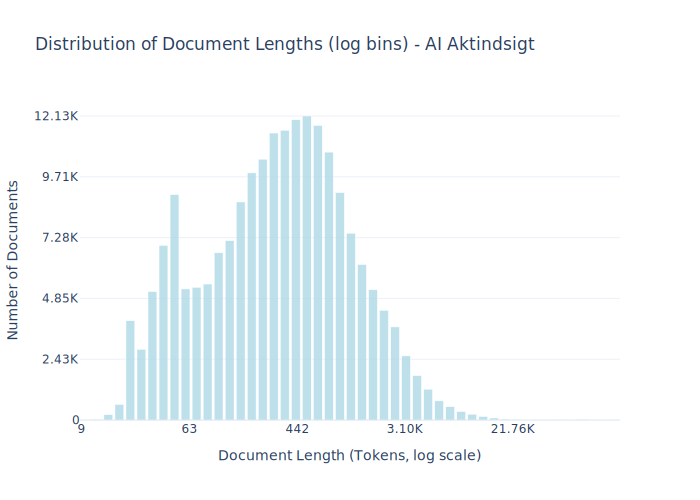

# Dataset Card for AI Aktindsigt

<!-- START-SHORT DESCRIPTION -->
Multiple web scrapes from municipality websites collected as a part of the [AI-aktindsigt](https://ai-aktindsigt.dk) project.
<!-- END-SHORT DESCRIPTION -->

The dataset consists of multiple scrapes of municipal websites compiled in connection with the work on the [AI-aktindsigt](https://ai-aktindsigt.dk) project. The scrape is made across different domains from several different municipalities.


## Dataset Description

<!-- START-DESC-STATS -->
- **Number of samples**: 200.91K
- **Number of tokens (Llama 3)**: 139.23M
- **Average document length in tokens (min, max)**: 693.0064405666105 (9, 152.60K)
<!-- END-DESC-STATS -->


## Dataset Structure
An example from the dataset looks as follows.


<!-- START-SAMPLE -->
```py
{
  "id": "ai-aktindsigt_0",
  "text": "Vallensbæk Stationstorv 100 2665 Vallensbæk Strand Telefon: +45 4797 4000",
  "source": "ai-aktindsigt",
  "added": "2025-03-24",
  "created": "2010-01-01, 2024-03-18",
  "token_count": 29
}
```

### Data Fields

An entry in the dataset consists of the following fields:

- `id` (`str`): An unique identifier for each document.
- `text`(`str`): The content of the document.
- `source` (`str`): The source of the document.
- `added` (`str`): An date for when the document was added to this collection.
- `created` (`str`): An date range for when the document was originally created.
- `token_count` (`int`): The number of tokens in the sample computed using the Llama 8B tokenizer
<!-- END-SAMPLE -->


### Dataset Statistics

<!-- START-DATASET PLOTS -->
<p align="center">

</p>
<!-- END-DATASET PLOTS -->


## Additional Information


### Sourced data
This dataset is derived from [`AI-aktindsigt/Skrabet_kommunale_hjemmesider`](https://huggingface.co/datasets/AI-aktindsigt/Skrabet_kommunale_hjemmesider/tree/main
)

### Citation Information

No citation is applicable for this work. We recommend citing the huggingface repository.
