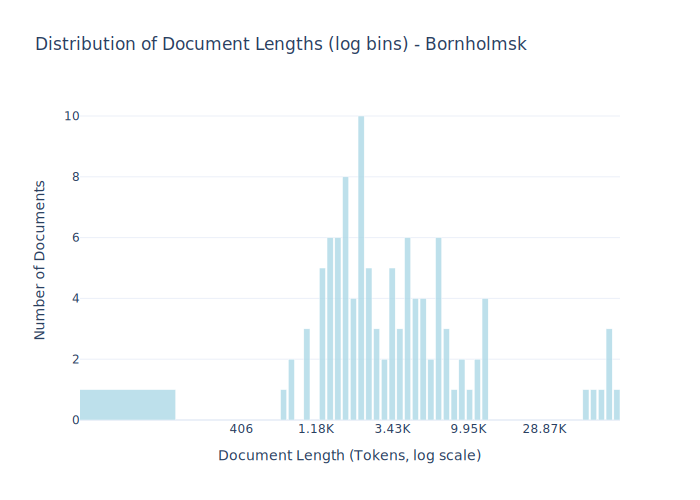

# Dataset Card for Bornholmsk 

## Dataset Description

<!-- START-SHORT DESCRIPTION -->
The Bornholmsk Ordbog Dictionary Project
<!-- END-SHORT DESCRIPTION -->

Fictional texts of various kinds written in Bornholmsk, the dialect spoken on the Danish island of Bornholm (The language code for Bornholmsk under IETF BCP-47 is da-bornholm), have been digitized (OCR’ed and proofread) by volunteers working within the recently resumed Bornholmsk Ordbog dictionary project (Kjeldsen, 2019). Most of the material included is written by Otto J. Lund in the period 1930-48 (novels, short stories, and poems). The Bornholmsk subcorpus, which in its present state amounts to circa 400 K words, also includes folk stories published by J. P. Kuhre in 1938, and by K. M. Kofoed in 1935, fictional letters by various authors published in the 1930s, as well as poems by Alfred Jensen published in 1948 and various other texts from the same period. The non-standardized orthography varies considerably from source to source. The Bornholmsk part of the Danish Gigaword is a significantly extended dataset, well beyond that studied in earlier NLP work on the dialect [(Derczynski and Kjeldsen, 2019)](https://aclanthology.org/W19-6138/).


<!-- START-DESC-STATS -->
- **Number of samples**: 106
- **Number of tokens (Llama 3)**: 847.97K
- **Average document length in tokens (min, max)**: 8.00K (407, 83.79K)
<!-- END-DESC-STATS -->


## Dataset Structure
An example from the dataset looks as follows.


<!-- START-SAMPLE -->
```py
{
  "id": "botxt_0000040",
  "text": "Ræua-Lârs\n\nRæua-Lârs å hans Konna, Stina, bode uda i Torpabakkana. Hanj hed nok æjla Lârs\nNielsen, m[...]",
  "source": "botxt",
  "added": "2024-05-16",
  "created": "2000-01-01, 2022-01-01",
  "token_count": 7229
}
```

### Data Fields

An entry in the dataset consists of the following fields:

- `id` (`str`): An unique identifier for each document.
- `text`(`str`): The content of the document.
- `source` (`str`): The source of the document (see [Source Data](#source-data)).
- `added` (`str`): An date for when the document was added to this collection.
- `created` (`str`): An date range for when the document was originally created.
- `token_count` (`int`): The number of tokens in the sample computed using the Llama 8B tokenizer
<!-- END-SAMPLE -->

### Dataset Statistics

<!-- START-DATASET PLOTS -->
<p align="center">

</p>
<!-- END-DATASET PLOTS -->


## Additional Information


### Citation Information

This dataset was initially published as part of the [Danish gigaword](https://huggingface.co/danish-foundation-models). We recommend that you cite and reference it if you use this dataset:

> Derczynski, L., Ciosici, M. R., et al. (2021). The Danish Gigaword Corpus. In Proceedings of the 23rd Nordic Conference on Computational Linguistics (NoDaLiDa 2021).

```bash
@inproceedings{dagw,
 title = {{The Danish Gigaword Corpus}},
 author = {Leon Derczynski and Manuel R. Ciosici and Rebekah Baglini and Morten H. Christiansen and Jacob Aarup Dalsgaard and Riccardo Fusaroli and Peter Juel Henrichsen and Rasmus Hvingelby and Andreas Kirkedal and Alex Speed Kjeldsen and Claus Ladefoged and Finn Årup Nielsen and Jens Madsen and Malte Lau Petersen and Jonathan Hvithamar Rystrøm and Daniel Varab},
 year = 2021,
 booktitle = {Proceedings of the 23rd Nordic Conference on Computational Linguistics},
 publisher = {NEALT}
}
```
