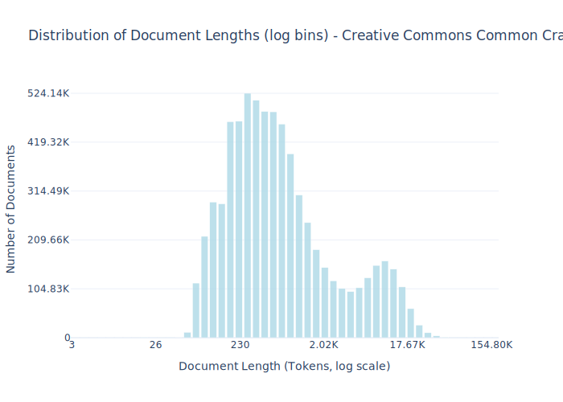

# Dataset Card for Creative Commons Common Crawl

<!-- START-SHORT DESCRIPTION -->
A dataset consisting of permissively licensed web pages processed from common crawl.
<!-- END-SHORT DESCRIPTION -->

This dataset contains text from 52 Common Crawl snapshots, covering about half of Common Crawl snapshots available to date and covering all years of operations of Common Crawl up to 2024. We found a higher level of duplication across this collection, suggesting that including more snapshots would lead to a modest increase in total token yield. From these snapshots, we extract HTML content using FastWarc. Then, using a regular expression adapted from the C4Corpus project. To ensure license accuracy, we manually verified the top 1000 domains by content volume, retaining only the 537 domains with confirmed licenses where the Creative Commons designation applied to the all text content rather than embedded media or a subset of the text on the domain. As an additional check, we did a second round of annotations with the assistance of OpenAI's o3 model. Specifically, we instructed the model to examine each web domain and identify the ones that were openly licensed. We then had a second team manually annotate the cases where the AI does not approve of the domain but the original human auditor did. This resulted in todo domains being removed.

We extract the main content of these documents and remove boilerplate using Resiliparse. We perform URL-level exact deduplication and use Bloom filters to remove near-duplicates with 80% ngram overlap. We also employ rule-based filters matching Dolma; namely, we use C4-derived heuristics to filter pages containing Javascript, Lorem Ipsum, and curly braces {}. We also apply all Gopher rules to remove low-quality pages. Per-document license information is available in the license entry of the metadata field of each example. Code for collecting, processing, and preparing this dataset is available in the common-pile GitHub repo.


## Dataset Description

<!-- START-DESC-STATS -->
- **Number of samples**: 6.85M
- **Number of tokens (Llama 3)**: 13.99B
- **Average document length in tokens (min, max)**: 2.04K (3, 154.80K)
<!-- END-DESC-STATS -->


## Dataset Structure
An entry in the dataset consists of the following fields:

- `id` (`str`): An unique identifier for each document.
- `text`(`str`): The content of the document.
- `source` (`str`): The source of the document.
- `added` (`str`): An date for when the document was added to this collection.
- `created` (`str`): An date range for when the document was originally created.
- `token_count` (`int`): The number of tokens in the sample computed using the Llama 8B tokenizer


### Additional Processing


### Dataset Statistics

<!-- START-DATASET PLOTS -->
<p align="center">

</p>
<!-- END-DATASET PLOTS -->


# Additional Information

## License Information
While we aim to produce datasets with completely accurate licensing information, license laundering and inaccurate metadata can cause us to erroneously assign the incorrect license to some documents (for further discussion of this limitation, please see our paper). If you believe you have found an instance of incorrect licensing in this dataset, please start a discussion on this repository. This dataset has been updated to remove instances of incorrect licensing. If you require the exact version that Comma v0.1 was trained on for non-commercial research purposes, please start a discussion on this repository.

### Citation Information

If you use this dataset, please cite:
```bibtex
@article{kandpal2025common,
  title={{The Common Pile v0.1: An 8TB Dataset of Public Domain and Openly Licensed Text}},
  author={Nikhil Kandpal and Brian Lester and Colin Raffel and Sebastian Majstorovic and Stella Biderman and Baber Abbasi and Luca Soldaini and Enrico Shippole and A. Feder Cooper and Aviya Skowron and Shayne Longpre and Lintang Sutawika and Alon Albalak and Zhenlin Xu and Guilherme Penedo and Loubna Ben  and Elie Bakouch and John David  and Honglu Fan and Dashiell Stander and Guangyu Song and Aaron Gokaslan and John Kirchenbauer and Tom Goldstein and Brian R and Bhavya Kailkhura and Tyler Murray},
  journal={arXiv preprint},
  year={2025}
}
```
