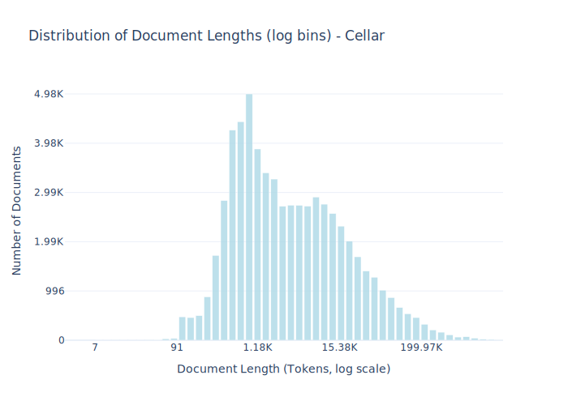

# Dataset Card for Cellar

<!-- START-SHORT DESCRIPTION -->
The official digital repository for European Union legal documents and open data.
<!-- END-SHORT DESCRIPTION -->

The EU Dataset Cellar serves as the central access point for all official EU publications, legislation, and open data resources. Maintained by the Publications Office of the European Union, this comprehensive digital archive contains millions of documents in multiple languages, including regulations, directives, decisions, treaties, case law, and preparatory acts dating back decades. The repository employs standardized metadata and unique identifiers to organize its vast collection, making it an essential resource for researchers, legal professionals, policymakers, and citizens seeking authoritative information on EU law and policy. The Cellar's linked data architecture also enables sophisticated search capabilities and integration with other information systems across the European Union's digital landscape.

## Dataset Description

<!-- START-DESC-STATS -->
- **Number of samples**: 63.40K
- **Number of tokens (Llama 3)**: 1.15B
- **Average document length in tokens (min, max)**: 18.17K (7, 2.60M)
<!-- END-DESC-STATS -->

## Dataset Structure
An entry in the dataset consists of the following fields:

- `id` (`str`): An unique identifier for each document.
- `text`(`str`): The content of the document.
- `source` (`str`): The source of the document (see [Source Data](#source-data)).
- `added` (`str`): An date for when the document was added to this collection.
- `created` (`str`): An date range for when the document was originally created.
- `token_count` (`int`): The number of tokens in the sample computed using the Llama 8B tokenizer

### Additional Processing

### Dataset Statistics

<!-- START-DATASET PLOTS -->

<!-- END-DATASET PLOTS -->

# Additional Information

## License Information

### Citation Information

No citation applicable.
