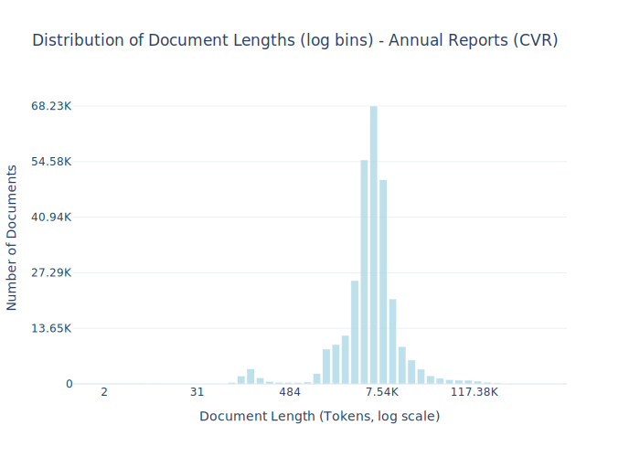

# Dataset Card for Annual Reports (CVR)

<!-- START-SHORT DESCRIPTION -->
Annual reports from danish companies in the period 2010-2025. 
<!-- END-SHORT DESCRIPTION -->

This dataset contains text extracted from annual reports (årsrapporter) filed by companies in Denmark. Below is a brief explanation of how these reports are created, what they typically include, and the legal framework that governs them. Read more about the system [here](https://erhvervsstyrelsen.dk/vejledning-aarsrapporter).

### Legal Framework
Danish annual reports are regulated primarily by the Danish Financial Statements Act (Årsregnskabsloven). This law defines:

- Which companies are required to prepare and file annual reports
- What information must be included, depending on company size and type
- The applicable accounting standards
- Deadlines and enforcement mechanisms
- Oversight is carried out by the Danish Business Authority (Erhvervsstyrelsen), which operates the public platform where reports are submitted and published.

### Purpose
Annual reports are created to:

- Provide transparency to stakeholders (owners, investors, creditors, the public)
- Comply with legal and tax obligations
- Enable public access to key financial and structural information about companies operating in Denmark

### Reporting Requirements
All Danish companies (except cetain types, such as sole proprietorships: [see more](https://erhvervsstyrelsen.dk/vejledning-aarsrapporter#chapter1-1)) must submit an annual report, usually within 6 months after the end of their financial year. Reports vary in complexity depending on the company’s accounting class:

### Typical Contents of an Annual Report
While the exact structure varies, Danish annual reports commonly include the following sections:

- Management’s Statement: A signed declaration of responsibility
- Independent Auditor’s Report (if applicable)
- Management Commentary: Overview of financial performance, risks, and strategic direction
- Income Statement
- Balance Sheet
- Statement of Changes in Equity
- Notes: Detailed explanations of accounting policies, risks, employees, related parties, etc.

Reports are typically submitted in XBRL (machine-readable) and/or PDF (human-readable) formats. The primary language is Danish, but some large or international companies may file English versions.

### Public Availability
Once filed, all annual reports are made publicly accessible through the Danish Business Authority’s platform https://datacvr.virk.dk. This supports Denmark’s broader commitment to transparency and open government data.

## Dataset Description

<!-- START-DESC-STATS -->
- **Number of samples**: 288.35K
- **Number of tokens (Llama 3)**: 2.32B
- **Average document length in tokens (min, max)**: 8.05K (2, 1.83M)
<!-- END-DESC-STATS -->

## Dataset Structure
An entry in the dataset consists of the following fields:

- `id` (`str`): An unique identifier for each document.
- `text`(`str`): The content of the document.
- `source` (`str`): The source of the document.
- `added` (`str`): An date for when the document was added to this collection.
- `created` (`str`): An date range for when the document was originally created.
- `token_count` (`int`): The number of tokens in the sample computed using the Llama 8B tokenizer

### Additional Processing

**Text Extraction:** The texts are gathered in PDFs, so for extracting the tests we have used the [marker-pdf](https://github.com/datalab-to/marker/tree/master) python library.

**Deduplication:** Since the reports—particularly those from smaller companies—often contain large amounts of standardized text (notably in the Independent Auditor’s Report section), we applied semantic deduplication with a similarity threshold of 0.95 to reduce redundancy in the dataset.

### Dataset Statistics

<!-- START-DATASET PLOTS -->

<!-- END-DATASET PLOTS -->

# Additional Information

## License Information
> Indgået mundtlig aftale mellem DFM og repræsentant for Erhversstyrelsen.  
> Ved spørgsmål kontakt os på mail: kristian.n.jensen@alexandra.dk
>

### Citation Information
