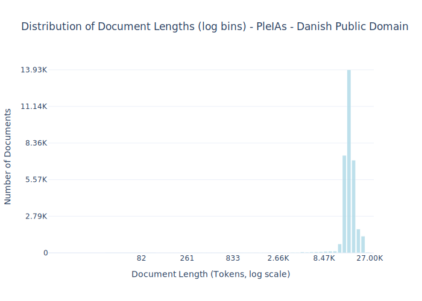

# Dataset Card for PleIAs - Danish Public Domain

<!-- START-SHORT DESCRIPTION -->
**PleIAs - Danish Public Domain** is a large collection aiming to aggregate all Danish monographies and periodicals in the public domain.
<!-- END-SHORT DESCRIPTION -->

The collection contains 3113 individual titles making up 322,141,347 words recovered from multiple sources, including Internet Archive and various European national libraries and cultural heritage institutions. Each parquet file has the full text of 2,000 books selected at random.

## Dataset Description

<!-- START-DESC-STATS -->
- **Number of samples**: 33.28K
- **Number of tokens (Llama 3)**: 532.43M
- **Average document length in tokens (min, max)**: 16.00K (82, 27.00K)
<!-- END-DESC-STATS -->

## Dataset Structure
An entry in the dataset consists of the following fields:

- `id` (`str`): An unique identifier for each document.
- `text`(`str`): The content of the document.
- `source` (`str`): The source of the document.
- `added` (`str`): An date for when the document was added to this collection.
- `created` (`str`): An date range for when the document was originally created.
- `token_count` (`int`): The number of tokens in the sample computed using the Llama 8B tokenizer

### Additional Processing

### Dataset Statistics

<!-- START-DATASET PLOTS -->

<!-- END-DATASET PLOTS -->

# Additional Information

## License Information
The entire collection is in the public domain in all regions. This means that the patrimonial rights of each individual or collective right holders have expired.

There has been a debate for years in Europe over the definition of public domain and the possibility to restrict its use. Since 2019, the EU Copyright Directive states that "Member States shall provide that, when the term of protection of a work of visual art has expired, any material resulting from an act of reproduction of that work is not subject to copyright or related rights, unless the material resulting from that act of reproduction is original in the sense that it is the author's own intellectual creation." (art. 14)

### Citation Information

The corpus was stored and processed with the generous support of Scaleway. It was built up with the support and concerted efforts of the state start-up LANGU:IA (start-up d’Etat), supported by the French Ministry of Culture and DINUM, as part of the prefiguration of the service offering of the Alliance for Language technologies EDIC (ALT-EDIC).

Corpus collection has been largely facilitated thanks to the open science LLM community insights, cooperation and support (Occiglot, Eleuther AI, OpenLLM France, Allen AI).

  
  
  

