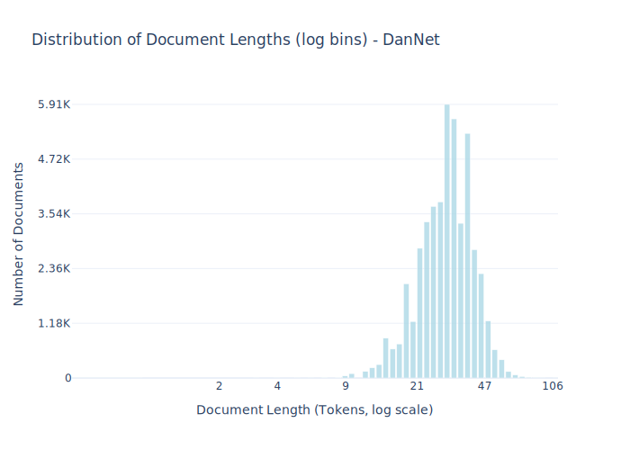

# Dataset Card for DanNet 

<!-- START-SHORT DESCRIPTION -->
[DanNet](https://cst.ku.dk/projekter/dannet) is a Danish WordNet.
<!-- END-SHORT DESCRIPTION -->


A WordNet is a lexico-semantic network which show the meaning and the relation between words through named connections. It can be considered a machine-readable dictionary.


## Dataset Description


<!-- START-DESC-STATS -->
- **Number of samples**: 47.60K
- **Number of tokens (Llama 3)**: 1.48M
- **Average document length in tokens (min, max)**: 31.079364745919374 (2, 106)
<!-- END-DESC-STATS -->


## Dataset Structure
An example from the dataset looks as follows.


<!-- START-SAMPLE -->
```py
{
  "id": "dannet_46506",
  "text": "Når fodboldholdet fra 1. division i Ikast spiller hjemmekampe, lyder råbet ud over Ikast Stadion: We[...]",
  "source": "dannet",
  "added": "2020-09-24",
  "created": "2000-01-01, 2022-01-01",
  "token_count": 50
}
```

### Data Fields

An entry in the dataset consists of the following fields:

- `id` (`str`): An unique identifier for each document.
- `text`(`str`): The content of the document.
- `source` (`str`): The source of the document.
- `added` (`str`): An date for when the document was added to this collection.
- `created` (`str`): An date range for when the document was originally created.
- `token_count` (`int`): The number of tokens in the sample computed using the Llama 8B tokenizer
<!-- END-SAMPLE -->


### Dataset Statistics

<!-- START-DATASET PLOTS -->
<p align="center">

</p>
<!-- END-DATASET PLOTS -->


## License Information
<details>
<summary>DanNet 1.0 License</summary>
<p>
Commercial Use of DanNet

DanNet may be used in commercial applications in accordance with the following
license agreement. An attorney representing the commercial interest should
review this DanNet license with respect to the intended use.

DanNet 1.0 License

DanNet Release 2.1

This software and database is being provided to you, the LICENSEE, by University
of Copenhagen and Society for Danish Language and Literature under the following
license. By obtaining, using and/or copying this software and database, you
agree that you have read, understood, and will comply with these terms and
conditions.

Permission to use, copy, modify and distribute this software and database and
its documentation for any purpose and without fee or royalty is hereby granted,
provided that you agree to comply with the following copyright notice and
statements, including the disclaimer, and that the same appear on ALL copies of
the software, database and documentation, including modifications that you make
for internal use or for distribution.

THIS SOFTWARE AND DATABASE IS PROVIDED "AS IS" AND UNIVERSITY OF COPENHAGEN and
SOCIETY FOR DANISH LANGUAGE AND LITERATURE MAKE NO REPRESENTATIONS OR
WARRANTIES, EXPRESS OR IMPLIED. BY WAY OF EXAMPLE, BUT NOT LIMITATION,
UNIVERSITY OF COPENHAGEN AND SOCIETY FOR DANISH LANGUAGE AND LITERATURE MAKE NO
REPRESENTATIONS OR WARRANTIES OF MERCHANTABILITY OR FITNESS FOR ANY PARTICULAR
PURPOSE OR THAT THE USE OF THE LICENSED SOFTWARE, DATABASE OR DOCUMENTATION WILL
NOT INFRINGE ANY THIRD PARTY PATENTS, COPYRIGHTS, TRADEMARKS OR OTHER RIGHTS.

The names of University of Copenhagen and Society for Danish Language and
Literature may not be used in advertising or publicity pertaining to
distribution of the software and/or database. Title to copyright in this
software, database and any associated documentation shall at all times remain
with University of Copenhagen and Society for Danish Language and Literature and
LICENSEE agrees to preserve same.

DanNet 2.1 Copyright 2009-12 by University of Copenhagen and Society for Danish
</p>
</details>


## Additional Information

<!-- TODO:
Add issue on:

Potential improvements for dannet

I imagine that there is a lot of information in DanNet
that could be used to create training datasets for LLMs (more than what is already present)
 -->

### Citation Information

This dataset was initially published as part of the [Danish gigaword](https://huggingface.co/danish-foundation-models). We recommend that you cite and reference it if you use this dataset:

> Derczynski, L., Ciosici, M. R., et al. (2021). The Danish Gigaword Corpus. In Proceedings of the 23rd Nordic Conference on Computational Linguistics (NoDaLiDa 2021).

```bash
@inproceedings{dagw,
 title = {{The Danish Gigaword Corpus}},
 author = {Leon Derczynski and Manuel R. Ciosici and Rebekah Baglini and Morten H. Christiansen and Jacob Aarup Dalsgaard and Riccardo Fusaroli and Peter Juel Henrichsen and Rasmus Hvingelby and Andreas Kirkedal and Alex Speed Kjeldsen and Claus Ladefoged and Finn Årup Nielsen and Jens Madsen and Malte Lau Petersen and Jonathan Hvithamar Rystrøm and Daniel Varab},
 year = 2021,
 booktitle = {Proceedings of the 23rd Nordic Conference on Computational Linguistics},
 publisher = {NEALT}
}
```
