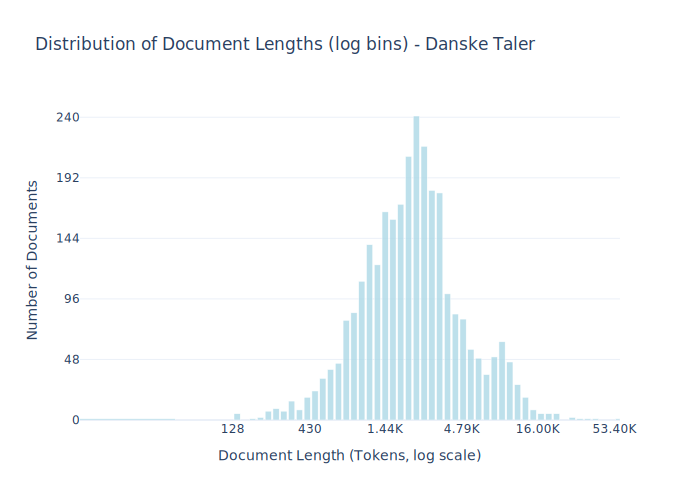

# Dataset Card for Danske Taler

<!-- START-SHORT DESCRIPTION -->
Danish Speeches from [dansketaler.dk](https://www.dansketaler.dk).
<!-- END-SHORT DESCRIPTION -->

The database dansketaler.dk is managed by Danske Taler, an independent institution that in addition to managing the database and carries out cultural
and democratic projects based on speeches. 
Danske Taler state as their goals that they seek to preserve our cultural heritage and promotes active citizenship and democratic confidence through its work. 
Additionally, Danske Taler provides data to a number of online resources, including: lex.dk, sprogteknologi.dk, and ordnet.dk.

The goal of the dataset is to collect historical and timely speeches and make them available for the public.

Learn more about danske taler by reading their [about us](https://www.dansketaler.dk/om-os) page.

> NOTE: Danske-Taler is also collecting [sermons](https://www.dansketaler.dk/praedikener), but these are not included in this dataset. 

## Dataset Description

<!-- START-DESC-STATS -->
- **Number of samples**: 2.91K
- **Number of tokens (Llama 3)**: 8.72M
- **Average document length in tokens (min, max)**: 3.00K (129, 53.40K)
<!-- END-DESC-STATS -->

## Dataset Structure
An entry in the dataset consists of the following fields:

- `id` (`str`): An unique identifier for each document.
- `text`(`str`): The content of the document.
- `source` (`str`): The source of the document.
- `added` (`str`): An date for when the document was added to this collection.
- `created` (`str`): An date range for when the document was originally created.
- `token_count` (`int`): The number of tokens in the sample computed using the Llama 8B tokenizer

### Additional Processing

### Dataset Statistics

<!-- START-DATASET PLOTS -->

<!-- END-DATASET PLOTS -->

## Additional Information

### Dataset Collection Process

This dataset was collected using the publicly available [API](https://www.dansketaler.dk/api/v1). 

### Quality Assurance
We check for and remove exact duplicates, empty texts, duplicate ids after the initial download. We additionally check if the articles contain any HTML.

## Opportunities for Improvement

While this dataset can be updated to include the latest availabe speeches. 

We consider the quality of the current collection high with a low chance of 
incorrect formatting, 
spelling errors,
empty documents or 
misformatted segments. 
This stems both from the quality assurance, source of documents and subjective inspection.

### License Information
Since the license information isn't avaiable through the API we collect this data directly from the webpage of each article under the header 
"Ophavsret".

For speeches where it is noted that *"Materialet er fri af ophavsret"* (The material is in the public domain) or similarly we assign it a `cc0` license.

Such an example can be seen here:

> **Ophavsret**
> 
> Materialet er fri af ophavsret. Taler, som er holdt i offentligheden, er ikke omfattet af ophavsret (Jf. ophavsretslovens § 26 og 32). 
> Det betyder, at når en tale er indgået i Danske Talers database, kan den bruges af tredjeparter, fx til undervisning eller forskning.
>
> *source: [Ursula von der Leyens tale om europæisk forsvar og sikkerhed på Hærens Officersskole](https://www.dansketaler.dk/tale/tale-om-europaeisk-forsvar-og-sikkerhed-pa-haerens-officersskole)*

Speeches without this mention is removed. Such an example include:

> **Ophavsret**
> 
> Materialet er beskyttet af ophavsret
>
> *Source: [Christina Egelunds tale ved Aarhus Universitets årsfest](https://www.dansketaler.dk/tale/christina-egelunds-tale-ved-aarhus-universitets-arsfest)*

We manually checked the unique set of license descriptions to see if any were open licenses that weren't included in the current criteria.

For specific filtering criteria see the `create.py` script.

### Citation Information

No citation is applicable for this work. We recommend citing the huggingface repository.
