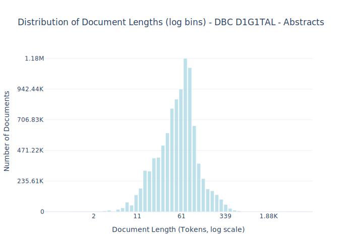

# Dataset Card for DBC D1G1TAL - Abstracts 

<!-- START-SHORT DESCRIPTION -->
dbc-abstracts consists of more than 11.6 million abstracts of books and other materials collected and created by [DBC D1G1TAL](https://dbcdigital.dk/) (former Dansk Bibliotekscenter).
<!-- END-SHORT DESCRIPTION -->

The dataset contains millions of abstracts in the Danish lanugage, which are supplemented by English, Norwegian, Swedish, German, and other language abstracts.
The dataset was collected and created by DBC D1G1TAL A/S as one of the backbones for their catalogue of books and other materials.
The dataset includes abstracts created between 1991 and 2024.

## Dataset Description

<!-- START-DESC-STATS -->
- **Number of samples**: 9.89M
- **Number of tokens (Llama 3)**: 694.42M
- **Average document length in tokens (min, max)**: 70.2343489339804 (2, 10.41K)
<!-- END-DESC-STATS -->

## Dataset Structure
An entry in the dataset consists of the following fields:

- `id` (`str`): An unique identifier for each document.
- `text`(`str`): The content of the document.
- `source` (`str`): The source of the document.
- `added` (`str`): An date for when the document was added to this collection.
- `created` (`str`): An date range for when the document was originally created.
- `token_count` (`int`): The number of tokens in the sample computed using the Llama 8B tokenizer

### Additional Processing

### Dataset Statistics

<!-- START-DATASET PLOTS -->

<!-- END-DATASET PLOTS -->

# Additional Information

## License Information
Danish Foundation Models have a written agreement with DBC D1G1TAL regarding the use of the data for training and releasing models. 
Data will only be available at the entity during the project. Requests regarding access to the dataset should be directed to the data owner DBC D1G1TAL.

### Citation Information

No citation at the moment.
