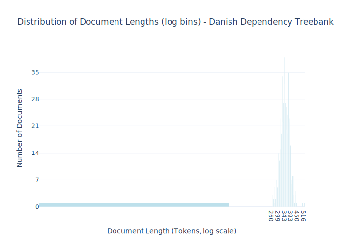

# Dataset Card for Danish Dependency Treebank

<!-- START-SHORT DESCRIPTION -->
The Danish subsection of the [Universal Dependencies Treebank](https://github.com/UniversalDependencies/UD_Danish-DDT).
<!-- END-SHORT DESCRIPTION -->


The Danish UD treebank has been converted from the Danish Dependency Treebank (Buch-Kromman, 2003) into Universal Dependencies (UD). It consists of 5,512 sentences (100k words). The Danish source texts and the Danish part-of-speech tags were created by the PAROLE-DK project (Keson 1998) by the Danish Society for Language and Literature.

While the dataset was initially intended as a rich annotation, this corpora only uses the raw text.

## Dataset Description


<!-- START-DESC-STATS -->
- **Number of samples**: 536
- **Number of tokens (Llama 3)**: 185.45K
- **Average document length in tokens (min, max)**: 345.99626865671644 (261, 517)
<!-- END-DESC-STATS -->


## Dataset Structure
An example from the dataset looks as follows.


<!-- START-SAMPLE -->
```py
{
  "id": "depbank_0375",
  "text": "\nH.L. Hansen var en usædvanmlig og frodig personlighed. Han skabte \nglæde og munterhed omkring sig o[...]",
  "source": "depbank",
  "added": "2024-05-16",
  "created": "2000-01-01, 2022-01-01",
  "token_count": 389
}
```

### Data Fields

An entry in the dataset consists of the following fields:

- `id` (`str`): An unique identifier for each document.
- `text`(`str`): The content of the document.
- `source` (`str`): The source of the document (see [Source Data](#source-data)).
- `added` (`str`): An date for when the document was added to this collection.
- `created` (`str`): An date range for when the document was originally created.
- `token_count` (`int`): The number of tokens in the sample computed using the Llama 8B tokenizer
<!-- END-SAMPLE -->


### Dataset Statistics

<!-- START-DATASET PLOTS -->
<p align="center">

</p>
<!-- END-DATASET PLOTS -->


## Additional Information

<!-- TODO:
Add issue on:

Potential improvements for depbank:
1) Pull directly from depbank
2) Compute texts into documents (seems like that is already done)
3) Add synthetic data instruction dataset
- NER: What are the following names in this sentence
  - json output, html annotation, list at the end
- POS: 
  - Extract all POS-tags from the following sentence
  - Find all NOUNS in the following text
  - What POS tag does the ..
- Tokenization:
  - split the following text into tokens
- ...
 -->

### Citation Information

This dataset was initially published as part of the [Danish gigaword](https://huggingface.co/danish-foundation-models). We recommend that you cite and reference it if you use this dataset:

> Derczynski, L., Ciosici, M. R., et al. (2021). The Danish Gigaword Corpus. In Proceedings of the 23rd Nordic Conference on Computational Linguistics (NoDaLiDa 2021).

```bash
@inproceedings{dagw,
 title = {{The Danish Gigaword Corpus}},
 author = {Leon Derczynski and Manuel R. Ciosici and Rebekah Baglini and Morten H. Christiansen and Jacob Aarup Dalsgaard and Riccardo Fusaroli and Peter Juel Henrichsen and Rasmus Hvingelby and Andreas Kirkedal and Alex Speed Kjeldsen and Claus Ladefoged and Finn Årup Nielsen and Jens Madsen and Malte Lau Petersen and Jonathan Hvithamar Rystrøm and Daniel Varab},
 year = 2021,
 booktitle = {Proceedings of the 23rd Nordic Conference on Computational Linguistics},
 publisher = {NEALT}
}
```
