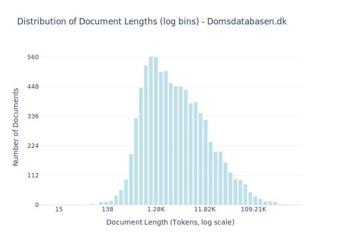

# Dataset Card for Domsdatabasen.dk

<!-- START-SHORT DESCRIPTION -->
[Domsdatabasen.dk](https://domsdatabasen.dk/) is a public database containing selected judgments from the Danish courts.
<!-- END-SHORT DESCRIPTION -->

Launched in early 2022, the platform aims to increase transparency and public insight into the workings of the judiciary in Denmark. It is accessible to everyone – legal professionals, citizens, companies, and public authorities interested in Danish case law.

## Dataset Description

### Purpose and Scope
The main goal of the database is to support the principle of openness in the administration of justice. It offers users access to selected civil and criminal decisions, with an initial focus on rulings from the higher courts, such as:

- The Supreme Court (Højesteret)
- The High Courts (Landsretterne)
- The Maritime and Commercial Court (Sø- og Handelsretten)

Some rulings from the district courts (byretterne) are also included, particularly when they are part of a case string that has been appealed.
Over time, the database will expand in coverage and volume, especially as the court system transitions to new digital case management systems.

### Pseudonymization and Data Protection
All published rulings are pseudonymized to protect the privacy of individuals involved, in accordance with the EU General Data Protection Regulation (GDPR), the Danish Data Protection Act, and rules from the Danish Data Protection Agency.

Pseudonymization involves replacing personally identifiable information (e.g., names, CPR numbers) with general terms such as “the accused”, “witness 1”, etc. Additional data such as addresses or health-related details may be redacted or pseudonymized based on a case-specific evaluation.

Some roles and names are not pseudonymized, including:

- Judges from higher courts
- Legal representatives (lawyers)
- Author names in cited legal literature (unless directly involved in the case)
- Names in EU court decisions

Businesses involved in cases are typically not pseudonymized unless their name reveals personal information or constitutes a trade secret.

### Access and Development
Domsdatabasen is continuously being developed. As digitization progresses and technical workflows improve, the number of published decisions is expected to grow. The judgments are published as full case strings, including decisions at multiple judicial levels, providing context and legal reasoning throughout the appeal process.


<!-- START-DESC-STATS -->
- **Number of samples**: 8.47K
- **Number of tokens (Llama 3)**: 86.35M
- **Average document length in tokens (min, max)**: 10.20K (15, 1.01M)
<!-- END-DESC-STATS -->


## Dataset Structure
An example from the dataset looks as follows.


<!-- START-SAMPLE -->
```py
{
  "id": "11389",
  "text": "## **Ikke grundlag for varetægtsfængsling af hensyn til retshåndhævelsen**\n\nDer var ikke særligt bes[...]",
  "source": "Domsdatabasen",
  "added": "2025-07-04",
  "created": "2025-07-04, 2025-07-04",
  "token_count": 796
}
```

### Data Fields

An entry in the dataset consists of the following fields:

- `id` (`str`): An unique identifier for each document.
- `text`(`str`): The content of the document.
- `source` (`str`): The source of the document.
- `added` (`str`): An date for when the document was added to this collection.
- `created` (`str`): An date range for when the document was originally created.
- `token_count` (`int`): The number of tokens in the sample computed using the Llama 8B tokenizer
<!-- END-SAMPLE -->


## License Information
<details>
<summary>Danish Copyright Law</summary>
<p>
Danish Copyright law at https://www.retsinformation.dk/forms/r0710.aspx?id=164796 states 

 § 9. Love, administrative forskrifter, retsafgørelser og lignende offentlige aktstykker er ikke genstand for ophavsret.

Stk. 2. Bestemmelsen i stk. 1 gælder ikke for værker, der fremtræder som selvstændige bidrag i de i stk. 1 nævnte aktstykker. Sådanne værker må dog gengives i forbindelse med aktstykket. Retten til videre udnyttelse afhænger af de i øvrigt gældende regler.

</p>
</details>


### Dataset Statistics

<!-- START-DATASET PLOTS -->
<p align="center">

</p>
<!-- END-DATASET PLOTS -->


## Additional Information

**Extraction of text:** The documents being downloaded from [domsdatabasen.dk](https://www.domsdatabasen.dk/) is PDFs. To extract the texts from those, the `create.py` script uses the [marker-pdf](https://github.com/datalab-to/marker/tree/master) package.
