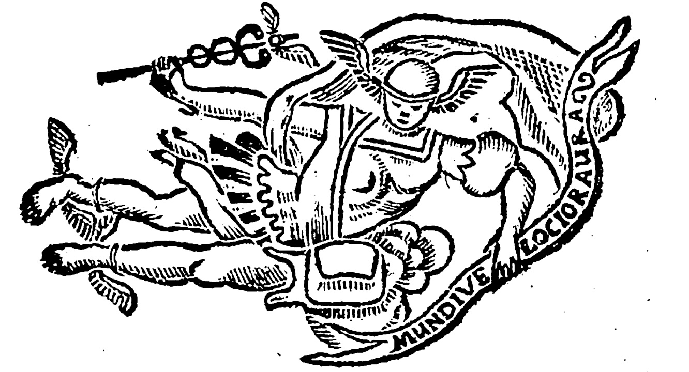
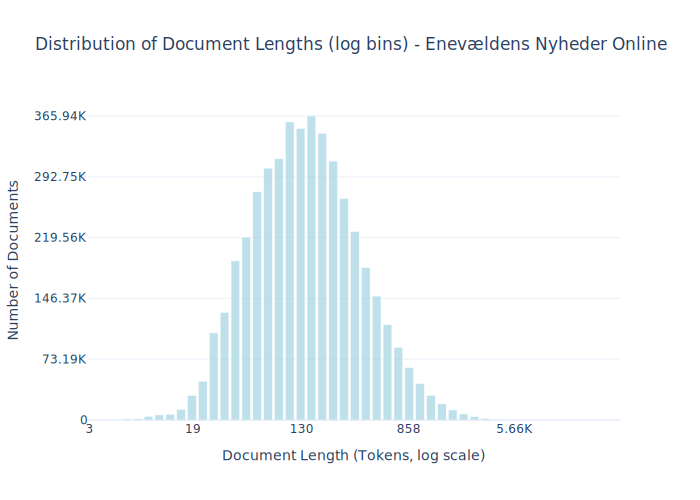
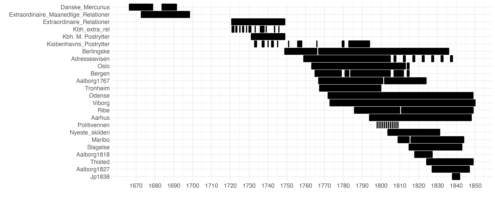
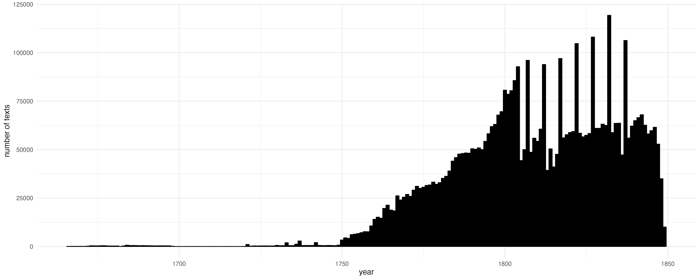

# Dataset Card for Enevældens Nyheder Online


<!-- START-SHORT DESCRIPTION -->
High quality OCR'd texts from Danish and Norwegian newspapers during the period of constitutional absolutism in Denmark (1660–1849).
<!-- END-SHORT DESCRIPTION -->


During the eighteenth century, newspapers became a ubiquitous medium. They informed a relatively large reading public about everything from high politics to the mundanities of local markets. 
The dataset was created by re-processing over 550.000 digital images scanned from microfilm and held in the Danish Royal Library's collection. They had initially been OCR-processed, but the results were generally unreadable. ENO reprocessed the images using tailored pylaia models in Transkribus. The OCR-quality is generally high, despite the difficult state of the original images.
The newspaper editions have been segmented into individual texts using a model designed by the project team. Such texts are the base entity of the dataset. They include mainly two genres: news items and advertisements.

## Dataset Description


<!-- START-DESC-STATS -->
- **Number of samples**: 4.59M
- **Number of tokens (Llama 3)**: 1.03B
- **Average document length in tokens (min, max)**: 225.1811458085686 (3, 37.29K)
<!-- END-DESC-STATS -->


* **Curated by**: Johan Heinsen and Camilla Bøgeskov, Historisk Datalaboratorium, Aalborg University. With assistance from Sofus Landor Dam, Anders Birkemose, Kamilla Matthiassen and Louise Karoline Sort. 
* **Funded by**: MASSHINE, Aalborg University.


The dataset contains a wide range of newspapers. The total distribution can be studied here. They cover most of Denmark as well as the three oldest newspapers of Norway, running until the separation of the Danish-Norwegian conglomerate in 1814. This dataset represents version 0.9 (updated 5th of August 2025).


### Dataset Sources

The sources of the dataset can be studied in more detail at the [project website](https://hislab.quarto.pub/eno/).
Most of the original image material is available in [LOAR](https://loar.kb.dk/handle/1902/7803) – a data repository of the Danish Royal Library. The Norwegian material was downloaded via the API of Nettbiblioteket. The scans of Nyeste Skilderie af Kjøbenhavn were taken from the Internet Archive repository of [Niels Jensen](https://archive.org/details/@uforbederlig). The scans for Politivennen stem from [Københavns Biblioteker](https://bibliotek.kk.dk/din/bag-om-kobenhavn/politivennen). Some early newspapers come from recent scans made available to the project by the Danish Royal Library. These are not yet available online.

## Uses

This dataset represents an effort to enable analysis of Denmark-Norway in the seventeenth, eighteenth, and nineteenth centuries. The data can be used to study and model sentiments, political and cultural currents, and the minutiae of urban life.

In addition, this dataset is part of Danish Dynaword, a collection of datasets intended for training language models, thereby integrating Danish cultural heritage into the next generation of digital technologies.


    
## Dataset Structure
An example from the dataset looks as follows.


<!-- START-SAMPLE -->
```py
{
  "id": "enevaeldens_nyheder_aalborg1767_1767-01-02_1000001",
  "text": "Et Menneske er skabt ey for sig selv allene: Hvert Lem paa Legemet det heele tiene maae, En Stolpes [...]",
  "source": "enevaeldens_nyheder",
  "added": "2025-08-05",
  "created": "1767-01-02, 1767-01-02",
  "token_count": 2377
}
```

### Data Fields

An entry in the dataset consists of the following fields:

- `id` (`str`): An unique identifier for each document.
- `text`(`str`): The content of the document.
- `source` (`str`): The source of the document (see [Source Data](#source-data)).
- `added` (`str`): An date for when the document was added to this collection.
- `created` (`str`): An date range for when the document was originally created.
- `token_count` (`int`): The number of tokens in the sample computed using the Llama 8B tokenizer
<!-- END-SAMPLE -->


## Dataset Creation

### Curation Rationale

The newspapers in the dataset generally represent the longest-running newspaper series in the Danish and Norwegian libraries. We prioritised long-running newspapers to enable historical analysis of changes over time. As historians, this was our initial ambition: to allow us to get quality serial text data. 
We also prioritised geographical diversity, representing different regions of Denmark-Norway. Of course, this varies over time, as newspapers were most common in Copenhagen until the late eighteenth century.
Since the newspapers of Denmark's Caribbean colonies were primarily in English, they are not included. The text recognition model designed for the project struggles with English text.
Besides long-running series, we also included a few smaller newspaper series, mainly with an eye towards diversity of subject matter. These include Politivennen, which was concerned with very local news from Copenhagen and carried a lot of reader contributions, offering a unique insight into urban sentiments at the time. A similar inclusion was made with Jyllandsposten (of 1838), which was defined by a somewhat radical rural horizon.

As a rule of thumb, publications have been digitised in total, as they exist in their respective collections. 
This means that they sometimes include appendices and sometimes do not, depending on whether these exist. Holes in the dataset mirror holes in the archival collections. 
The one exception to this rule is the newspaper Københavns Adresseavis. This advertisement paper has survived continuously from its inception in 1759, but from 1804 onwards, it is only included here with samples every fifth year. 
The reason for sampling is a combination of the massive extent of this advertisement paper and the poor condition of the digital images available for this specific period. Combined this meant that the results of the text recognition process were not entirely satisfying relative to the resources necessary for the effort. Therefore, we decided to prioritize other publications that would yield better quality text.

Most publications contain title page marginalia (date, title, etc.). Because these were set with large ornamental types, they are typically recognised with much less accuracy than the regular text. We are currently working on implementing a step in the workflow to identify and filter out these elements.

### Data Collection and Processing

The text recognition model used to create the dataset is available via [Transkribus](https://app.transkribus.org/models/public/text/danish-newspapers-1750-1850). A description of the text segmentation process can be found [here](https://hislab.quarto.pub/eno/dokumentation.html). Besides segmentation into separate news items / advertisements, no further processing of the text has taken place. We are currently experimenting with automated error correction using decoder-models.

For Danish Dynaword we apply additional filtering including:

- 1) Removing 1 word documents (using a whitespace split) 
- 2) Removing document with a PWA < 0.7

PWA is defined as:

> A predicted word accuracy [PWA] based on a dictionary consisting of words from literary works, personal names and place names from the census of 1787, and a manually curated list of common words that are present in the material, but not represented in canonical literature. This is an estimate. In general we advise that you filter the dataset on this variable in case of using the material for language modelling. This will also filter out texts in other languages than Danish.
>
> source: [JohanHeinsen/ENO](https://huggingface.co/datasets/JohanHeinsen/ENO#dataset-structure)

Below you see 10 examples of documents (truncated to 200 characters) filtered out due to the PWA filtering:

```
['Under Staders Segl. nespil.',
 'Frisk Selter=, Permonter=, Bitter, og FachingerVand bekommes paa Løveapotheket.',
 'Søesyglinsk, Christoph. Auf Anordning der Liquidations=Commission, den ten August 1834. (Ges.) Mitglied der Commission, Regierungsrath: Pestof. Stellvertretender Secretair. Gabriel Ostrowski.',
 'J de Reussiske Koge: Bordelummer Seil.',
 'Scriptores historiae Byzantinae vird bei uns un entgeltlich ansgegeben. Anch sind bei und fortige Bogen dieses Werkes in den verschiedenen Ansgeden auf Druck., Schreibe und Velinpapier niedergelegt, z',
 'Gammel Conjac. Potten.',
 'NOTIFICATION. Von der 5ten Classe, der 7ten Königl. allen privilegitten Kopenhagner Lotteren, deren Ziehung den 17ten Passati geendiget worden, werden die Gewinne den 8ten hujus und følgende Werkeltag',
 'Jm Verlag des Unterzeichneten har die Presse verlassen: Uever dis religiøse Bestimmung der Jugend, in einigen Predigten von K. C. von Gehren. Jn dieser Samlung sind følgende Gegenstande behandelt: 1) ',
 "ditoyens fortund, ) vous qui, loin des combats, Pouves jouir en pair dans vos heureur ClimatsDes trefors annuel d'unne moisson fertileDont il plait aux saisons de couronner votre ile, Vous, diseje, a ",
 'AVERTISSEMENTS. Ausser der am Seelandischen Langericht geschehene Proclamation, wird auch hiedurch zu dreien mahlen kund gethan, das die Theilungs Berichtigung nach dem menland Johann Georg Kanneworff']
 ```

### Dataset Statistics

<!-- START-DATASET PLOTS -->
<p align="center">

</p>
<!-- END-DATASET PLOTS -->

The coverage of the newspapers included can be seen here:



The distribution of texts pr. year is as follows:




## Personal and Sensitive Information

Due to the historical nature of the data, ENO contains no personal or sensitive information.

## Bias, Risks, and Limitations

The data reflects the time of its initial creation. This means that it mirrors and describes a deeply hierarchical society that was structured by deep-seated biases and forms of discrimination that are alien even to some of the worst among the living today. For example, the material contains racist language in describing contemporary phenomena such as the Transatlantic slave trade and the persecution of Jewish diasporas. Use cases which might relay or perpetuate such sentiments should be aware of these risks. It is a historical text corpora, warts and all.

Please also note that, although the newspapers are all in Danish, they do contain intermittent passages in German and Latin.

Some advertisements were reprinted verbatim. The dataset, therefore, includes occasional duplicate texts.


### License Information

The dataset is licensed under CC BY-SA 4.0. Please note that this license only pertains to the digitised text and dataset curation, not the original images. The original images of all material stemming from The Danish Royal Library, Nettbiblioteket, Københavns Biblioteker as well as the scans of Nyeste Skilderie af Kiøbenhavn made available by Niels Jensen are all in the public domain.

## More Information

For questions related to the dataset, curation, and annotation we please contact Johan Heinsen, Aalborg University <heinsen@dps.aau.dk>
