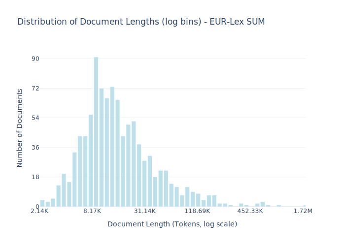

# Dataset Card for EUR-Lex SUM

<!-- START-SHORT DESCRIPTION -->
The Danish subsection of EUR-lex SUM consisting of EU legislation paired with professionally written summaries.
<!-- END-SHORT DESCRIPTION -->

EUR-Lex SUM is a dataset containing summaries of EU legislation from the EUR-Lex database. It consists of pairs of full legal texts and their corresponding professionally written summaries, covering European Union legal documents.
The dataset is designed for training and evaluating automatic text summarization systems, particularly for legal documents. It's valuable for natural language processing (NLP) research since it provides high-quality, human-written summaries of complex legal texts in a specialized domain.

## Dataset Description

<!-- START-DESC-STATS -->
- **Number of samples**: 1.00K
- **Number of tokens (Llama 3)**: 31.37M
- **Average document length in tokens (min, max)**: 31.31K (2.14K, 1.72M)
<!-- END-DESC-STATS -->

## Dataset Structure
An entry in the dataset consists of the following fields:

- `id` (`str`): An unique identifier for each document.
- `text`(`str`): The content of the document.
- `source` (`str`): The source of the document (see [Source Data](#source-data)).
- `added` (`str`): An date for when the document was added to this collection.
- `created` (`str`): An date range for when the document was originally created.
- `token_count` (`int`): The number of tokens in the sample computed using the Llama 8B tokenizer

### Additional Processing

### Dataset Statistics

<!-- START-DATASET PLOTS -->

<!-- END-DATASET PLOTS -->

# Additional Information

## License Information

### Citation Information

No citation is applicable for this work.
