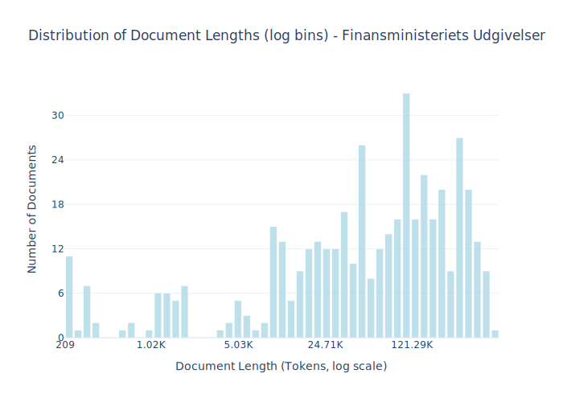

# Dataset Card for Finansministeriets Udgivelser

<!-- START-SHORT DESCRIPTION -->
The official publication series of the Danish Ministry of Finance containing economic analyses, budget proposals, and fiscal policy documents.
<!-- END-SHORT DESCRIPTION -->

Finansministeriets Udgivelser (translated as "Publications of the Ministry of Finance") is the publishing arm or publication series of the Danish Ministry of Finance. It includes official reports, economic analyses, budget proposals, fiscal policy documents, and various other publications related to Denmark's public finances, economic policy, and financial governance.

These publications typically provide insights into Denmark's economic outlook, public spending plans, tax policies, and financial reforms. They serve as important reference materials for economists, policy makers, researchers, and citizens interested in understanding Denmark's financial policies and economic direction.

The publications are authoritative sources of information on Danish fiscal policy and are often used by various stakeholders to track and analyze the country's economic performance and public finance management.

## Dataset Description

<!-- START-DESC-STATS -->
- **Number of samples**: 443
- **Number of tokens (Llama 3)**: 50.34M
- **Average document length in tokens (min, max)**: 113.62K (209, 595.33K)
<!-- END-DESC-STATS -->

## Dataset Structure
An entry in the dataset consists of the following fields:

- `id` (`str`): An unique identifier for each document.
- `text`(`str`): The content of the document.
- `source` (`str`): The source of the document (see [Source Data](#source-data)).
- `added` (`str`): An date for when the document was added to this collection.
- `created` (`str`): An date range for when the document was originally created.
- `token_count` (`int`): The number of tokens in the sample computed using the Llama 8B tokenizer

### Additional Processing

### Dataset Statistics

<!-- START-DATASET PLOTS -->

<!-- END-DATASET PLOTS -->

# Additional Information

## License Information

### Citation Information

No citation is applicable for this work.
