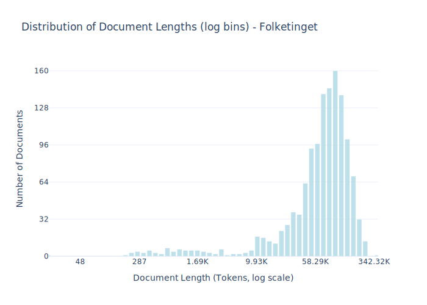

# Dataset Card for Folketinget

## Dataset Description

<!-- START-SHORT DESCRIPTION -->
Records from all meetings of The Danish parliament (Folketinget) in the parliament hall. 
<!-- END-SHORT DESCRIPTION -->


All records have a transcript produced by commercial Automatic Speech Recognition (ASR) followed by postediting by linguists employed by Folketinget for intelligibility, i.e., edit out dysfluencies, restarts, repairs, and mistakes. The transcript is, therefore, not a representation of spoken Danish but rather information content.

In the parliament hall, one speaker at a time addresses members of the parliament. Monologues may include rebuttals or other comments to statements in previous monologues. While speakers can read aloud from a prepared statement or speak extemporaneously, we expect no difference to be apparent in the data because of the post-editing. The Folketinget section covers parliament hall sessions between 2009 and 2019. It contains discussions on a wide range of topics, issues, and named entities relevant to Danish society.


<!-- START-DESC-STATS -->
- **Number of samples**: 1.31K
- **Number of tokens (Llama 3)**: 114.09M
- **Average document length in tokens (min, max)**: 86.76K (49, 342.32K)
<!-- END-DESC-STATS -->


## Dataset Structure
An example from the dataset looks as follows.


<!-- START-SAMPLE -->
```py
{
  "id": "ft_20121M100",
  "text": "TALER 50: Mødet er åbnet. I dag er der følgende anmeldelser: Ministeren for by, bolig og landdistrik[...]",
  "source": "ft",
  "added": "2021-03-28",
  "created": "2009-01-01, 2019-01-01",
  "token_count": 84355
}
```

### Data Fields

An entry in the dataset consists of the following fields:

- `id` (`str`): An unique identifier for each document.
- `text`(`str`): The content of the document.
- `source` (`str`): The source of the document.
- `added` (`str`): An date for when the document was added to this collection.
- `created` (`str`): An date range for when the document was originally created.
- `token_count` (`int`): The number of tokens in the sample computed using the Llama 8B tokenizer
<!-- END-SAMPLE -->


### Dataset Statistics

<!-- START-DATASET PLOTS -->
<p align="center">

</p>
<!-- END-DATASET PLOTS -->


## Additional Information


### Citation Information

This dataset was initially published as part of the [Danish gigaword](https://huggingface.co/danish-foundation-models). We recommend that you cite and reference it if you use this dataset:

> Derczynski, L., Ciosici, M. R., et al. (2021). The Danish Gigaword Corpus. In Proceedings of the 23rd Nordic Conference on Computational Linguistics (NoDaLiDa 2021).

```bash
@inproceedings{dagw,
 title = {{The Danish Gigaword Corpus}},
 author = {Leon Derczynski and Manuel R. Ciosici and Rebekah Baglini and Morten H. Christiansen and Jacob Aarup Dalsgaard and Riccardo Fusaroli and Peter Juel Henrichsen and Rasmus Hvingelby and Andreas Kirkedal and Alex Speed Kjeldsen and Claus Ladefoged and Finn Årup Nielsen and Jens Madsen and Malte Lau Petersen and Jonathan Hvithamar Rystrøm and Daniel Varab},
 year = 2021,
 booktitle = {Proceedings of the 23rd Nordic Conference on Computational Linguistics},
 publisher = {NEALT}
}
```
