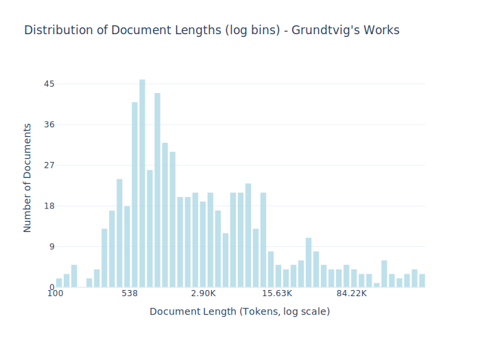

# Dataset Card for Grundtvig's Works

<!-- START-SHORT DESCRIPTION -->
The complete collection of [Grundtvig](https://en.wikipedia.org/wiki/N._F._S._Grundtvig) (1783-1872) one of Denmark’s most influential figures. 
<!-- END-SHORT DESCRIPTION -->


Grundtvig's Works is a comprehensive digital humanities dataset containing the complete collected writings of
[Nicolai Frederik Severin Grundtvig](https://en.wikipedia.org/wiki/N._F._S._Grundtvig) (1783-1872) was one of Denmark’s most influential cultural and intellectual figures. 
As a critical edition, it includes editorial commentary by philologists and is continually updated. 
The project is scheduled for completion in 2030 and will comprise 1,000 individual works spanning 35,000 pages. The complete edition is freely available online.

## Dataset Description


<!-- START-DESC-STATS -->
- **Number of samples**: 632
- **Number of tokens (Llama 3)**: 10.53M
- **Average document length in tokens (min, max)**: 16.65K (100, 453.72K)
<!-- END-DESC-STATS -->


This dataset represents version 1.25 (updated May 2025) of the digital scholarly edition of Grundtvig’s Works, comprising 632 texts by N.F.S. Grundtvig. 
All texts have been OCR-scanned, and each is processed through three separate textual collations. We compare three different first editions, identify variants between them, 
and incorporate their differences into the digitized version.

Following collation, we enrich the texts with several layers of annotation, marked up in XML according to TEI P5 guidelines. 

These include: 

- *Explanatory commentaries* – clarifying older words or shifts in meaning
- *Named entities* – identifying people, places, titles, and mythological figures
- *Emendations* – documenting any corrections (no silent changes are made)
- *Bible references* - allusions, quotations, and explicit references are identified and categorized according to type and source
- 
We also provide introductory texts and textual essays to offer historical and interpretive context. Before publication, each text undergoes a triple review process.


### Dataset Sources

- **Dataset Website:** [www.grundtvigsværker.dk](https://www.grundtvigsværker.dk)

## Uses

This dataset represents a major digital preservation effort of Denmark's literary and intellectual heritage, providing structured access to works that shaped Danish theology, education, democracy, and cultural identity. It's valuable for research in digital humanities, Scandinavian studies, religious history, and 19th-century European thought.

In addition, this dataset is also a part of [Danish Dynaword](https://huggingface.co/datasets/danish-foundation-models/danish-dynaword), a collection of dataset intended for training language models, thus integrating Danish Cultural Heritage into the next generation of digital technologies.


    
## Dataset Structure
An example from the dataset looks as follows.


<!-- START-SAMPLE -->
```py
{
  "id": "grundtvig_1824_392_txt",
  "text": "---\ntitle: Søgubrot med Efterklang\nauthor: Nicolai Frederik Severin Grundtvig\ndate: 2019-12-03\npubli[...]",
  "source": "grundtvig",
  "added": "2025-07-21",
  "created": "1824-01-01, 1824-12-31",
  "token_count": 4106
}
```

### Data Fields

An entry in the dataset consists of the following fields:

- `id` (`str`): An unique identifier for each document.
- `text`(`str`): The content of the document.
- `source` (`str`): The source of the document (see [Source Data](#source-data)).
- `added` (`str`): An date for when the document was added to this collection.
- `created` (`str`): An date range for when the document was originally created.
- `token_count` (`int`): The number of tokens in the sample computed using the Llama 8B tokenizer
<!-- END-SAMPLE -->


### Dataset Statistics

<!-- START-DATASET PLOTS -->
<p align="center">

</p>
<!-- END-DATASET PLOTS -->


## Dataset Creation

### Curation Rationale

The digital scholarly edition of Grundtvig’s Works was created to provide open, reliable, and annotated access to the entire published oeuvre of N.F.S. Grundtvig (1783–1872), one of Denmark’s most influential thinkers. The rationale behind this effort is twofold: public accessibility and scholarly accuracy.

On the one hand, the edition enables the general public to read Grundtvig’s works on their own terms, supported by textual commentary that helps decode complex 19th-century language and theological or philosophical concepts. On the other, the edition serves as a scholarly tool, offering a searchable, critically edited, and TEI-encoded corpus that facilitates in-depth research across disciplines.

Grundtvig’s writings have had a lasting influence on Danish culture, education, and national identity. They are frequently referenced in contemporary political and cultural debates. However, many of his texts have until now only existed in fragile first editions or scattered, outdated collections. By digitizing, editing, and annotating his complete published works – including posthumous publications central to his public image – the project ensures both preservation and access.

The primary motivation behind creating this dataset was to bridge the gap between Grundtvig’s historical significance and the limited access to his writings. By offering a freely accessible digital edition, the project not only preserves a vital part of Danish cultural heritage but also democratizes access to foundational texts in Danish intellectual history. This aligns with both public interest and scholarly needs: to make Grundtvig’s complex legacy understandable, searchable, and usable in modern contexts.

The edition was launched in 2010 by the Center for Grundtvig Studies and is scheduled for completion in 2030. It is funded by the Danish Finance Act, ensuring its continued development as a national cultural and scholarly resource.


#### Data Collection and Processing

All texts in the Grundtvig’s Works dataset originate from printed first editions of N.F.S. Grundtvig’s published writings. The digitization process begins with OCR (optical character recognition) scanning of the original editions. Following OCR, each text undergoes three separate textual collations: we compare three different first editions of the same work to identify textual variants. Differences are systematically incorporated into the digitized version to ensure accuracy and representational fidelity.

After collation, the editorial team performs further corrections based on internal editorial review. The final result is a fully digitized, TEI P5 XML–encoded version of each text.
On top of this, all works are accompanied by facsimiles – high-resolution images of the first printed editions – allowing users to view the original sources alongside the transcribed and annotated texts.


Before upload the dataset was provided as XML and .txt files. The XML files were converted to .md and uploaded to Huggingface. The scripts for conversion and upload can be found [here](https://huggingface.co/datasets/chcaa/grundtvigs-works/tree/main/src) and a [.lock](https://huggingface.co/datasets/chcaa/grundtvigs-works/tree/main) file specifying the version can be found here.


#### Who are the source data producers?

N.F.S. Grundtvig is the author of the source material. The Center for Grundtvig Studies at Aarhus University curates, digitizes, and maintains the dataset.

### Annotations

We annotate explanatory commentaries, named entities (people, places, titles, and mythological figures), biblical references and emendations (documenting corrections). Only emendations are part of this dataset.
The annotation process began in 2010 and will continue until 2030. 


#### Who are the annotators?

The editorial team consists of 12 philologists and 5 student assistants and one editor in chief.

As of 2025, the team includes 13 female and 5 male staff members.

### Formatting

The samples are currently formatted as markdown using a frontmatter which contain information about the author, year of digitization etc.

#### Personal and Sensitive Information

This dataset contains no personal or sensitive information.

## Bias, Risks, and Limitations

The Grundtvig’s Works dataset contains texts written in 19th-century Danish and reflects the linguistic, cultural, and ideological norms of its time.
As such, it includes perspectives, assumptions, and biases characteristic of the period.
Readers should be aware that the author, N.F.S. Grundtvig, expressed strong personal and political opinions, 
including nationalistic views and critical stances toward specific groups – such as Germans – which may be considered offensive or exclusionary by contemporary standards.


### License Information

N.F.S. Grundtvig's works fall under Public Domain (CC0)


### Citation Information

Studies where the dataset from Grundtvig’s Works has been used:

- Baunvig, K. F., & Nielbo, K. L. (2022). Mermaids are Birds: Embedding N.F.S. Grundtvig’s Bestiary. I K. Berglund, M. La Mela, & I. Zwart (red.), Proceedings of the 6th Digital Humanities in the Nordic and Baltic Countries Conference (DHNB 2022) (Bind 3232, s. 23-32). CEUR-WS.org. http://ceur-ws.org/Vol-3232/paper02.pdf
- Baunvig, K. F., Jarvis, O., & Nielbo, K. L. (2021). Emotional Imprints: Exclamation Marks in N.F.S. Grundtvig's Writings. I S. Reinsone, I. Skadiņa, J. Daugavietis, & A. Baklāne (red.), Post-Proceedings of the 5th Conference Digital Humanities in the Nordic Countries (DHN 2020) (s. 156-169) http://ceur-ws.org/Vol-2865/short7.pdf
- Nielbo, K.L., Baunvig, K. F., Liu, B., & Gao, J. (2019). A Curious Case of Entropic Decay: Persistent Complexity in Textual Cultural Heritage. Digital Scholarship in the Humanities, Volume 34, Issue 3, September 2019, Pages 542–557, https://doi.org/10.1093/llc/fqy054.

## More Information

For questions related to the dataset, curation, and annotation we please contact [Center for Grundtvig Studies](https://grundtvigcenteret.au.dk/)

The edition is funded by the Danish Finance Act
