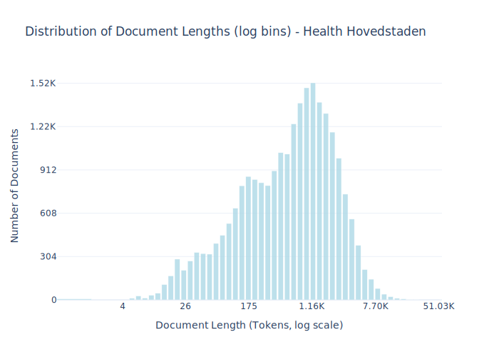

# Dataset Card for Health Hovedstaden

<!-- START-SHORT DESCRIPTION -->
Guidelines and informational documents for healthcare professionals from the Capital Region
<!-- END-SHORT DESCRIPTION -->

The document collection consists of guidelines and informational documents for healthcare professionals in the Capital Region of Denmark. The documents therefore contain a number of specialized terms and concepts that are frequently used within the healthcare sector.

The corpus was created based on the texts in the document collection and has been post-processed so that the texts can be used for the development of language technology.

Martin Sundahl Laursen and Thiusius R. Savarimuthu from the University of Southern Denmark have assisted the Danish Agency for Digital Government with the post-processing of the data. Read their joint paper on "[Automatic Annotation of Training Data for Deep Learning Based De-identification of Narrative Clinical Text](https://ceur-ws.org/Vol-3416/paper_5.pdf)."


## Dataset Description

<!-- START-DESC-STATS -->
- **Number of samples**: 24.00K
- **Number of tokens (Llama 3)**: 27.07M
- **Average document length in tokens (min, max)**: 1.13K (4, 51.03K)
<!-- END-DESC-STATS -->


## Dataset Structure
An example from the dataset looks as follows.

<!-- START-SAMPLE -->
```py
{
  "id": "health_hovedstaden_0",
  "text": "Acetylsalicylsyre - Aspirin, Akutlægebil\n\nMålgrupper og anvendelsesområde\nDefinitioner\nFremgangsmåde[...]",
  "source": "health_hovedstaden",
  "added": "2025-07-07",
  "created": "2015-01-01, 2020-12-31",
  "token_count": 766
}
```

### Data Fields

An entry in the dataset consists of the following fields:

- `id` (`str`): An unique identifier for each document.
- `text`(`str`): The content of the document.
- `source` (`str`): The source of the document (see [Source Data](#source-data)).
- `added` (`str`): An date for when the document was added to this collection.
- `created` (`str`): An date range for when the document was originally created.
- `token_count` (`int`): The number of tokens in the sample computed using the Llama 8B tokenizer
<!-- END-SAMPLE -->


### Additional Processing


### Unintended Uses

Please note that the corpus has been developed for the purpose of language technology development and should not be used as a source of healthcare information. The documents were scraped at a specific time and will therefore not be updated with changes. In this regard, please refer to the Capital Region of Denmark's document collection.


### Dataset Statistics

<!-- START-DATASET PLOTS -->
<p align="center">

</p>
<!-- END-DATASET PLOTS -->


# Additional Information

## License Information
The dataset have been released under a CC-0 license. 

### Citation Information

If you are using the data please reference the following paper [Automatic Annotation of Training Data for Deep Learning Based De-identification of Narrative Clinical Text](https://ceur-ws.org/Vol-3416/paper_5.pdf)
