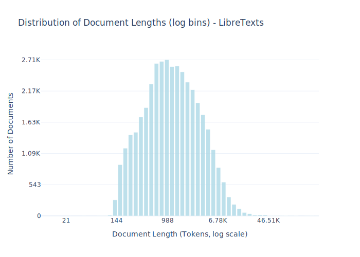

# Dataset Card for LibreTexts

<!-- START-SHORT DESCRIPTION -->
A catalog of open-access text books.
<!-- END-SHORT DESCRIPTION -->

LibreTexts is an online platform that provides a catalog of over 3,000 open-access textbooks. To collect openly licensed content from LibreTexts we gather links to all textbooks in the catalog and check each textbook section for a license statement indicating that it is in the public domain or under a CC BY, CC BY-SA, or the GNU Free Documentation License. We extract plaintext from these textbook sections directly from the HTML pages hosted on the LibreTexts website. Per-document license information is available in the license entry of the metadata field of each example. Code for collecting, processing, and preparing this dataset is available in the common-pile GitHub repo.


## Dataset Description

<!-- START-DESC-STATS -->
- **Number of samples**: 40.04K
- **Number of tokens (Llama 3)**: 84.19M
- **Average document length in tokens (min, max)**: 2.10K (21, 319.08K)
<!-- END-DESC-STATS -->


## Dataset Structure
An entry in the dataset consists of the following fields:

- `id` (`str`): An unique identifier for each document.
- `text`(`str`): The content of the document.
- `source` (`str`): The source of the document (see [Source Data](#source-data)).
- `added` (`str`): An date for when the document was added to this collection.
- `created` (`str`): An date range for when the document was originally created.
- `token_count` (`int`): The number of tokens in the sample computed using the Llama 8B tokenizer


### Additional Processing


### Dataset Statistics

<!-- START-DATASET PLOTS -->
<p align="center">

</p>
<!-- END-DATASET PLOTS -->


# Additional Information

## License Information
While we aim to produce datasets with completely accurate licensing information, license laundering and inaccurate metadata can cause us to erroneously assign the incorrect license to some documents (for further discussion of this limitation, please see our paper). If you believe you have found an instance of incorrect licensing in this dataset, please start a discussion on this repository.

### Citation Information

```bibtex
@article{kandpal2025common,
  title={{The Common Pile v0.1: An 8TB Dataset of Public Domain and Openly Licensed Text}},
  author={Nikhil Kandpal and Brian Lester and Colin Raffel and Sebastian Majstorovic and Stella Biderman and Baber Abbasi and Luca Soldaini and Enrico Shippole and A. Feder Cooper and Aviya Skowron and Shayne Longpre and Lintang Sutawika and Alon Albalak and Zhenlin Xu and Guilherme Penedo and Loubna Ben  and Elie Bakouch and John David  and Honglu Fan and Dashiell Stander and Guangyu Song and Aaron Gokaslan and John Kirchenbauer and Tom Goldstein and Brian R and Bhavya Kailkhura and Tyler Murray},
  journal={arXiv preprint},
  year={2025}
}
```
