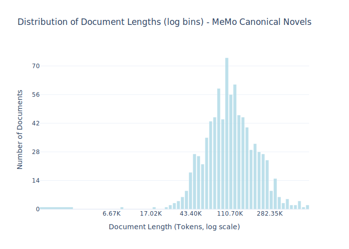

# Dataset Card for MeMo Canonical Novels

<!-- START-SHORT DESCRIPTION -->
The MeMo corpus comprising almost all Danish novels from the period 1870-1899, known as the Modern Breakthrough.
<!-- END-SHORT DESCRIPTION -->

The MeMo corpus is established to investigate literary and cultural change in a seminal epoch of Scandinavian cultural and social history (known as 'the modern breakthrough') using natural language processing and other computational methods. The corpus consists of original novels by Norwegian and Danish authors printed in Denmark in the period 1870-99. It includes 858 volumes, totaling 4.5 million sentences and 65 million words.

Additional information about this dataset can be found on their [project page](https://nors.ku.dk/english/research/projects/measuring-modernity/) or on their huggingface [dataset](https://huggingface.co/datasets/MiMe-MeMo/Corpus-v1.1). The dataset can be inspected online using [the Korp platform](https://alf.hum.ku.dk/korp/?mode=memo_all#?cqp=%5B%5D&corpus=memo_all).

## Dataset Description

<!-- START-DESC-STATS -->
- **Number of samples**: 858
- **Number of tokens (Llama 3)**: 113.74M
- **Average document length in tokens (min, max)**: 132.57K (6.67K, 720.17K)
<!-- END-DESC-STATS -->


## Dataset Structure
An example from the dataset looks as follows.

<!-- START-SAMPLE -->
```py
{
  "id": "1887_Paulsen_EnFremtidskvinde",
  "text": "En fremtidskvinde?\n\nSkrevet af John Paulsen\nPubliceret 1887 af Schubothe\n ------- \n\nDen skandinavisk[...]",
  "source": "memo",
  "added": "2025-06-23",
  "created": "1887-01-01, 1887-12-31",
  "token_count": 98454
}
```

### Data Fields

An entry in the dataset consists of the following fields:

- `id` (`str`): An unique identifier for each document.
- `text`(`str`): The content of the document.
- `source` (`str`): The source of the document.
- `added` (`str`): An date for when the document was added to this collection.
- `created` (`str`): An date range for when the document was originally created.
- `token_count` (`int`): The number of tokens in the sample computed using the Llama 8B tokenizer
<!-- END-SAMPLE -->


### Dataset Statistics

<!-- START-DATASET PLOTS -->
<p align="center">

</p>
<!-- END-DATASET PLOTS -->

### Processing

In addition to the text itself we prefix the document with the title, year, author name, pseudonym and publisher. This is to allow the model to learn the relation between the document and relevant metadata.


### Updated and Corrections

This version fixed a previous [issues]( https://huggingface.co/datasets/danish-foundation-models/danish-dynaword/discussions/67) in MeMo where the documents where incorrectly truncated and normalized. Removing this truncation led to a >10x increase in number of tokens. 


## Additional Information


### Contact
For questions related to the processing and conversion feel free to open a [discussion thread](https://huggingface.co/datasets/danish-foundation-models/danish-dynaword/discussions) for question related to the initial collect of the data please contact the project PI, Jens Bjerring-Hansen, associate professor at Copenhagen University.

### Citation Information

This dataset is derived from the publicly availabe dataset [MiMe-MeMo/Corpus-v1.1](https://huggingface.co/datasets/MiMe-MeMo/Corpus-v1.1) and was release as a part of paper Bjerring-Hansen, Jens, et al. "Mending Fractured Texts. A heuristic procedure for correcting OCR data." (2022). https://ceur-ws.org/Vol-3232/paper14.pdf. Which has the follwing citation:

```
@inproceedings{bjerring2022mending,
  title={Mending Fractured Texts. A heuristic procedure for correcting OCR data},
  author={Bjerring-Hansen, Jens and Kristensen-McLachlan, Ross Deans and Diderichsen, Philip and Hansen, Dorte Haltrup},
  booktitle={CEUR Workshop Proceedings},
  volume={3232},
  pages={177--186},
  year={2022},
  organization={ceur workshop proceedings}
}
```

### Other uses of this dataset

This study have additionally 
```
@inproceedings{feldkamp_canonical_2024,
    address = {Miami, Florida, USA},
    title = {Canonical {Status} and {Literary} {Influence}: {A} {Comparative} {Study} of {Danish} {Novels} from the {Modern} {Breakthrough} (1870--1900)},
    booktitle = {Proceedings of the {Joint} 4th {International} {Conference} on {Natural} {Language} {Processing} for {Digital} {Humanities}},
    publisher = {Association for Computational Linguistics, Forthcoming},
    author = {Feldkamp, Pascale and Lassche, Alie and Kostkan, Jan and Kardos, Márton and Baunvig, Katrine F. and Nielbo, Kristoffer L.},
    year = {2024},
}
```
