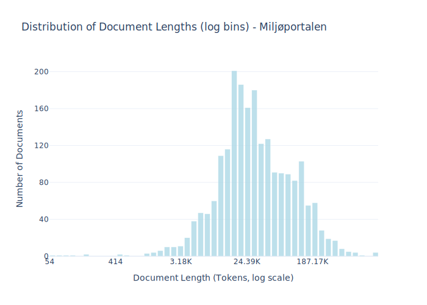

# Dataset Card for Miljøportalen

<!-- START-SHORT DESCRIPTION -->
Data from [Danmarks Miljøportalen](https://www.miljoeportal.dk/om-danmarks-miljoeportal/) (Denmark's Environment Portal)
<!-- END-SHORT DESCRIPTION -->

Denmark's Environment Portal (Danmarks Miljøportal) is a joint public partnership owned by the state, municipalities, and regions, which aims to support digital environmental management in Denmark.

Danmarks Miljøportal's goal is for environmental data to be included early in all decisions that have an environmental impact. They do this by creating easy and open access to environmental data, making it possible for authorities and businesses to integrate the environment into their decisions.

This can be decisions specifically targeted at the environment such as water plans, Green Tripartite Agreement, biodiversity and nature restoration, but also decisions about, for example, renewable energy, climate adaptation, new roads, residential areas, and industrial enterprises, where environmental aspects need to be considered.


## Dataset Description

<!-- START-DESC-STATS -->
- **Number of samples**: 2.12K
- **Number of tokens (Llama 3)**: 127.38M
- **Average document length in tokens (min, max)**: 60.08K (54, 1.44M)
<!-- END-DESC-STATS -->


## Dataset Structure
An example from the dataset looks as follows.


<!-- START-SAMPLE -->
```py
{
  "id": "miljoeportalen_0",
  "text": "Bila110  g   1 101 10 - miljTIL R  lj  TIL RTIL RøraÆTSHUSKO  pp  ÆTSHUS KOÆTSHUS Kort\n\nLOKALPLAN NR[...]",
  "source": "miljoeportalen",
  "added": "2025-03-24",
  "created": "2024-01-01, 2025-01-01",
  "token_count": 9054
}
```

### Data Fields

An entry in the dataset consists of the following fields:

- `id` (`str`): An unique identifier for each document.
- `text`(`str`): The content of the document.
- `source` (`str`): The source of the document.
- `added` (`str`): An date for when the document was added to this collection.
- `created` (`str`): An date range for when the document was originally created.
- `token_count` (`int`): The number of tokens in the sample computed using the Llama 8B tokenizer
<!-- END-SAMPLE -->


### Dataset Statistics

<!-- START-DATASET PLOTS -->
<p align="center">

</p>
<!-- END-DATASET PLOTS -->


## Additional Information


<!-- ### Data includes

TODO: KRISTIAN I assume this is just the website or is it also reports? 
-->

### License information
This dataset is licensed under CCO this license was clarified by support@miljoeportal.dk: 
 
> Data er underlagt Creative Common CC0, se:
> https://creativecommons.org/publicdomain/zero/1.0/deed.da.
> 
> Lad mig vide hvis du har yderligere spørgsmål.
> Har du spørgsmål til din sag eller yderligere kommentarer, bedes du besvare denne mail.


### Citation Information

No citation is applicable for this work.
