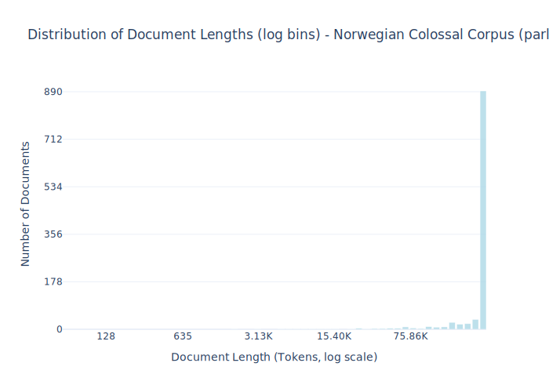

# Dataset Card for Norwegian Colossal Corpus (parliament)

<!-- START-SHORT DESCRIPTION -->
Collections from the Norwegian parliament in Danish. Extracted from the [Norwegian Colossal Corpus](https://huggingface.co/datasets/NbAiLab/NCC) derived from ocr.
<!-- END-SHORT DESCRIPTION -->

The Norwegian Colossal Corpus is a collection of multiple smaller Norwegian corpuses suitable for training large language models.

## Dataset Description

<!-- START-DESC-STATS -->
- **Number of samples**: 1.08K
- **Number of tokens (Llama 3)**: 338.87M
- **Average document length in tokens (min, max)**: 314.64K (129, 373.59K)
<!-- END-DESC-STATS -->


## Dataset Structure
An example from the dataset looks as follows.
<!-- START-SAMPLE -->
```py
{
  "id": "digistorting_1906-07_part6_vol-a_part2",
  "text": "Liknes —Aaroot i foranstaaende oversigt over omkostningerne er beregnet til kr. 37 500,00 under foru[...]",
  "source": "ncc_parliament",
  "added": "2025-05-08",
  "created": "2021-01-01, 2021-12-31",
  "token_count": 360308
}
```

### Data Fields

An entry in the dataset consists of the following fields:

- `id` (`str`): An unique identifier for each document.
- `text`(`str`): The content of the document.
- `source` (`str`): The source of the document.
- `added` (`str`): An date for when the document was added to this collection.
- `created` (`str`): An date range for when the document was originally created.
- `token_count` (`int`): The number of tokens in the sample computed using the Llama 8B tokenizer
<!-- END-SAMPLE -->


### Dataset Statistics

<!-- START-DATASET PLOTS -->
<p align="center">

</p>
<!-- END-DATASET PLOTS -->

## Additional Information

## License Information

This dataset is licensed under [NLOD 2.0](https://data.norge.no/nlod/en/2.0). 
This license is derived from the original [publication](https://huggingface.co/datasets/NbAiLab/NCC), which is published by the 
[National Library of Norway](https://www.nb.no/en/).

## Filtering

This subset is the result of the following filtering from all available data splits on the [NCC](https://huggingface.co/datasets/NbAiLab/NCC):

- is_parliament: Documents, which are tagged as parliament data
- language_filter: Document is classified as Danish with a threshold of 0.75
- min_length: Document has at least 10 words (whitespace separated strings + punctuation)
- alpha_ratio: The ratio of all words / words with only alphabetical characters is at least 0.7
- min_stop_words: The document contains at least 2 Danish stop words
- duplicate: Duplicate documents were removed

The effect of each of these steps is outlined in the table below:

| Filtering step  | Number of document |
| --------------- | ------------------ |
| is_parliament   | 9 528              |
| language_filter | 1 275              |
| min_length      | 1 275              |
| alpha_ratio     | 1 077              |
| min_stop_words  | 1 077              |
| duplicate       | 1 077              |

Note that a total of 976 long texts (>~1e5 tokens) were found.


### Quality

It is important to note, that recurring [OCR](https://en.wikipedia.org/wiki/Optical_character_recognition) errors and historic expressions in older 
texts hinder the legibility of some of the documents and make differentiating between Norwegian and Danish difficult.


### Citation Information

If you use this source please cite the following articles:

```
@inproceedings{kummervold-etal-2022-norwegian-colossal,
  title     = {The {N}orwegian colossal corpus: A text corpus for training large {N}orwegian language models},
  author    = {Kummervold, Per E  and
               Wetjen, Freddy    and
               De la Rosa, Javier},
  booktitle = {Proceedings of the Thirteenth Language Resources and Evaluation Conference (LREC)},
  year      = {2022},
  address   = {Marseille, France},
  publisher = {European Language Resources Association},
  url       = {https://aclanthology.org/2022.lrec-1.410},
  pages     = {3852--3860},
  abstract  = {Norwegian has been one of many languages lacking sufficient available text to train quality language models. In an attempt to bridge this gap, we introduce the Norwegian Colossal Corpus (NCC), which comprises 49GB of clean Norwegian textual data containing over 7B words. The NCC is composed of different and varied sources, ranging from books and newspapers to government documents and public reports, showcasing the various uses of the Norwegian language in society. The corpus contains mainly Norwegian Bokmål and Norwegian Nynorsk. Each document in the corpus is tagged with metadata that enables the creation of sub-corpora for specific needs. Its structure makes it easy to combine with large web archives that for licensing reasons could not be distributed together with the NCC. By releasing this corpus openly to the public, we hope to foster the creation of both better Norwegian language models and multilingual language models with support for Norwegian.},
}

@inproceedings{kummervold-etal-2021-operationalizing,
  title     = {Operationalizing a National Digital Library: The Case for a {N}orwegian Transformer Model},
  author    = {Kummervold, Per E  and
               De la Rosa, Javier  and
               Wetjen, Freddy  and
               Brygfjeld, Svein Arne},
  booktitle = {Proceedings of the 23rd Nordic Conference on Computational Linguistics (NoDaLiDa)},
  year      = {2021},
  address   = {Reykjavik, Iceland (Online)},
  publisher = {Linköping University Electronic Press, Sweden},
  url       = {https://aclanthology.org/2021.nodalida-main.3},
  pages     = {20--29},
  abstract  = {In this work, we show the process of building a large-scale training set from digital and digitized collections at a national library.
  The resulting Bidirectional Encoder Representations from Transformers (BERT)-based language model for Norwegian outperforms multilingual BERT (mBERT) models
  in several token and sequence classification tasks for both Norwegian Bokmål and Norwegian Nynorsk. Our model also improves the mBERT performance for other
  languages present in the corpus such as English, Swedish, and Danish. For languages not included in the corpus, the weights degrade moderately while keeping strong multilingual properties. Therefore,
  we show that building high-quality models within a memory institution using somewhat noisy optical character recognition (OCR) content is feasible, and we hope to pave the way for other memory institutions to follow.},
}

```
