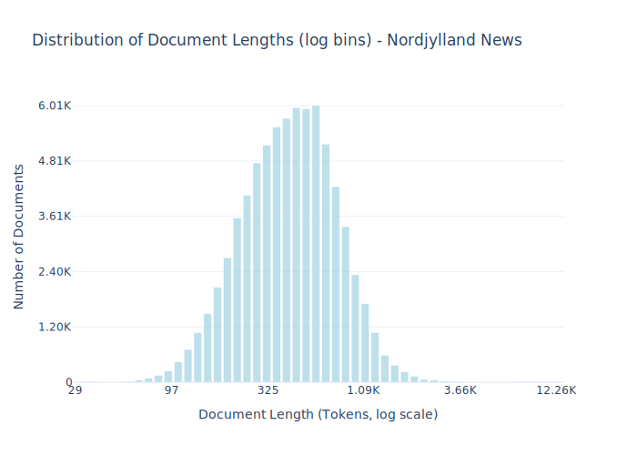

# Dataset Card for Nordjylland News

<!-- START-SHORT DESCRIPTION -->
Articles from the Danish Newspaper [TV2 Nord](https://www.tv2nord.dk).
<!-- END-SHORT DESCRIPTION -->


The data is derived from the Huggingface dataset [alexandrainst/nordjylland-news-summarization](https://huggingface.co/datasets/alexandrainst/nordjylland-news-summarization) originally intended for text summarization.

## Dataset Description


<!-- START-DESC-STATS -->
- **Number of samples**: 75.22K
- **Number of tokens (Llama 3)**: 37.90M
- **Average document length in tokens (min, max)**: 503.9497440670079 (29, 12.26K)
<!-- END-DESC-STATS -->


## Dataset Structure
An example from the dataset looks as follows.


<!-- START-SAMPLE -->
```py
{
  "id": "nordjyllandnews_0",
  "text": "Lav et referat af nedenstående tekst:\n\nTekst:\nOpdatering: Manden er nu fundet af Nordjyllands Politi[...]",
  "source": "nordjyllandnews",
  "added": "2024-12-16",
  "created": "2000-01-01, 2024-01-01",
  "token_count": 628
}
```

### Data Fields

An entry in the dataset consists of the following fields:

- `id` (`str`): An unique identifier for each document.
- `text`(`str`): The content of the document.
- `source` (`str`): The source of the document.
- `added` (`str`): An date for when the document was added to this collection.
- `created` (`str`): An date range for when the document was originally created.
- `token_count` (`int`): The number of tokens in the sample computed using the Llama 8B tokenizer
<!-- END-SAMPLE -->


### Dataset Statistics

<!-- START-DATASET PLOTS -->
<p align="center">

</p>
<!-- END-DATASET PLOTS -->


## Additional Information


## Opportunities for Improvement

An updated version of the this data could be fetched from their [API](https://developer.bazo.dk/#876ab6f9-e057-43e3-897a-1563de34397e).

# Sourced data
This dataset is derived from [`alexandrainst/nordjylland-news-summarization`](https://huggingface.co/datasets/alexandrainst/nordjylland-news-summarization)

### Citation Information

No citation is applicable for this work. We recommend citing the huggingface repository.
