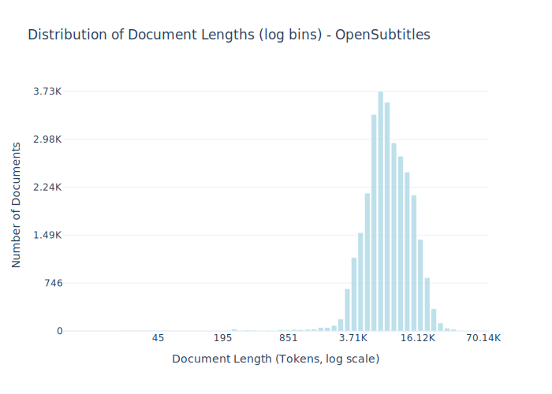

# Dataset Card for OpenSubtitles

<!-- START-SHORT DESCRIPTION -->
Danish subsection of [OpenSubtitles](https://opus.nlpl.eu/OpenSubtitles/corpus/version/OpenSubtitles).
<!-- END-SHORT DESCRIPTION -->


## Dataset Description

<!-- START-DESC-STATS -->
- **Number of samples**: 29.82K
- **Number of tokens (Llama 3)**: 271.60M
- **Average document length in tokens (min, max)**: 9.11K (45, 70.14K)
<!-- END-DESC-STATS -->


## Dataset Structure
An example from the dataset looks as follows.

<!-- START-SAMPLE -->
```py
{
  "id": "opensub_6822913",
  "text": "Tidligere i vikingerne...\nJeg skal gå tilbage til England.\nBurde være gået tilbage for lang tid side[...]",
  "source": "opensubtitles",
  "added": "2025-01-02",
  "created": "1920-01-01, 2018-01-01",
  "token_count": 3559
}
```

### Data Fields

An entry in the dataset consists of the following fields:

- `id` (`str`): An unique identifier for each document.
- `text`(`str`): The content of the document.
- `source` (`str`): The source of the document (see [Source Data](#source-data)).
- `added` (`str`): An date for when the document was added to this collection.
- `created` (`str`): An date range for when the document was originally created.
- `token_count` (`int`): The number of tokens in the sample computed using the Llama 8B tokenizer
<!-- END-SAMPLE -->


### Additional Processing

Due to copyright concern additional documents have been removed due to copyright concerns. These include:

```py
{
    # Der kommer en dag
    "opensub_6726481",
    "opensub_6732371",
    # Kollektivet
    "opensub_6645818",
    # Flaskepost fra P
    "opensub_6666922",
    "opensub_6720216",
    "opensub_6958711",
    # Fasandræberne
    "opensub_6036947",
    "opensub_6008622",
    # En du elsker
    "opensub_5828376",
    "opensub_5828378",
    # En chance til
    "opensub_6177523",
    # Lev stærkt
    "opensub_6467655",
    # Nymphomaniac
    "opensub_5604391",
    "opensub_5748340",
    "opensub_5748494",
    "opensub_5629516",
    # Kvinden i buret
    "opensub_5636248",
    "opensub_5514603",
    "opensub_5504932",
    # Den skaldede frisør
    "opensub_5084880",
    "opensub_5031826",
    # Jagten
    "opensub_6929419",
    "opensub_4885548",
    # Melancholia
    "opensub_4421330",
    "opensub_4406991",
    "opensub_4418817",
    # Ambassadøren
    "opensub_4557721",
    # Antichrist
    "opensub_5511502",
    "opensub_3938655",
    "opensub_3636940",
    "opensub_3564521",
    "opensub_3562215",
    # En kongelig affære
    "opensub_4725493",
    "opensub_4725160",
    "opensub_4725159",
    "opensub_4916871",
    "opensub_5186746",
    # Brødre
    "opensub_233943",
    "opensub_87475",
}
```

We have additionally removed duplicate entries from the original dataset.

### Dataset Statistics

<!-- START-DATASET PLOTS -->
<p align="center">

</p>
<!-- END-DATASET PLOTS -->


## Additional Information


### Citation Information

This dataset was initially published as part of the [Danish gigaword](https://huggingface.co/danish-foundation-models). We recommend that you cite and reference it if you use this dataset:

> Derczynski, L., Ciosici, M. R., et al. (2021). The Danish Gigaword Corpus. In Proceedings of the 23rd Nordic Conference on Computational Linguistics (NoDaLiDa 2021).

```bash
@inproceedings{dagw,
 title = {{The Danish Gigaword Corpus}},
 author = {Leon Derczynski and Manuel R. Ciosici and Rebekah Baglini and Morten H. Christiansen and Jacob Aarup Dalsgaard and Riccardo Fusaroli and Peter Juel Henrichsen and Rasmus Hvingelby and Andreas Kirkedal and Alex Speed Kjeldsen and Claus Ladefoged and Finn Årup Nielsen and Jens Madsen and Malte Lau Petersen and Jonathan Hvithamar Rystrøm and Daniel Varab},
 year = 2021,
 booktitle = {Proceedings of the 23rd Nordic Conference on Computational Linguistics},
 publisher = {NEALT}
}
```
