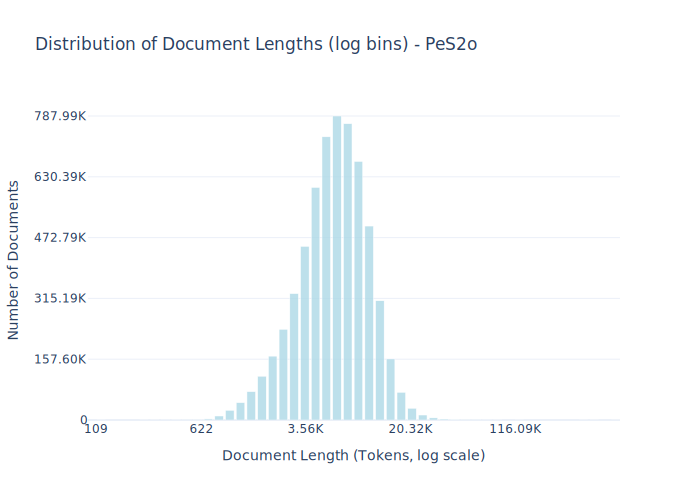

# Dataset Card for PeS2o

<!-- START-SHORT DESCRIPTION -->
A set of openly licensed scientific articles. 
<!-- END-SHORT DESCRIPTION -->

This dataset is a version of the peS2o dataset restricted to openly licensed articles. PeS2o is derived from S2ORC, a corpus of openly licensed abstract and full-text papers that have been converted to a structured format using Grobid. Starting from Grobid’s XML output, peS2o filters papers that are too short, have incorrect metadata, are in languages other than English, and contain OCR errors using a combination of heuristic- and model-based filtering steps. Please refer to the peS2o datasheet and code for more details on the peS2o processing pipeline. For the openly licensed articles in this collection, per-document license information is available in the license entry of the metadata field of each example.


## Dataset Description

<!-- START-DESC-STATS -->
- **Number of samples**: 6.11M
- **Number of tokens (Llama 3)**: 39.51B
- **Average document length in tokens (min, max)**: 6.47K (109, 663.21K)
<!-- END-DESC-STATS -->


## Dataset Structure
An entry in the dataset consists of the following fields:

- `id` (`str`): An unique identifier for each document.
- `text`(`str`): The content of the document.
- `source` (`str`): The source of the document (see [Source Data](#source-data)).
- `added` (`str`): An date for when the document was added to this collection.
- `created` (`str`): An date range for when the document was originally created.
- `token_count` (`int`): The number of tokens in the sample computed using the Llama 8B tokenizer


### Additional Processing


### Dataset Statistics

<!-- START-DATASET PLOTS -->
<p align="center">

</p>
<!-- END-DATASET PLOTS -->


# Additional Information

## License Information
While we aim to produce datasets with completely accurate licensing information, license laundering and inaccurate metadata can cause us to erroneously assign the incorrect license to some documents (for further discussion of this limitation, please see our paper). If you believe you have found an instance of incorrect licensing in this dataset, please start a discussion on this repository.

### Citation Information

If you use this dataset, please cite:
```bibtex
@article{kandpal2025common,
  title={{The Common Pile v0.1: An 8TB Dataset of Public Domain and Openly Licensed Text}},
  author={Nikhil Kandpal and Brian Lester and Colin Raffel and Sebastian Majstorovic and Stella Biderman and Baber Abbasi and Luca Soldaini and Enrico Shippole and A. Feder Cooper and Aviya Skowron and Shayne Longpre and Lintang Sutawika and Alon Albalak and Zhenlin Xu and Guilherme Penedo and Loubna Ben  and Elie Bakouch and John David  and Honglu Fan and Dashiell Stander and Guangyu Song and Aaron Gokaslan and John Kirchenbauer and Tom Goldstein and Brian R and Bhavya Kailkhura and Tyler Murray},
  journal={arXiv preprint},
  year={2025}
}
```
