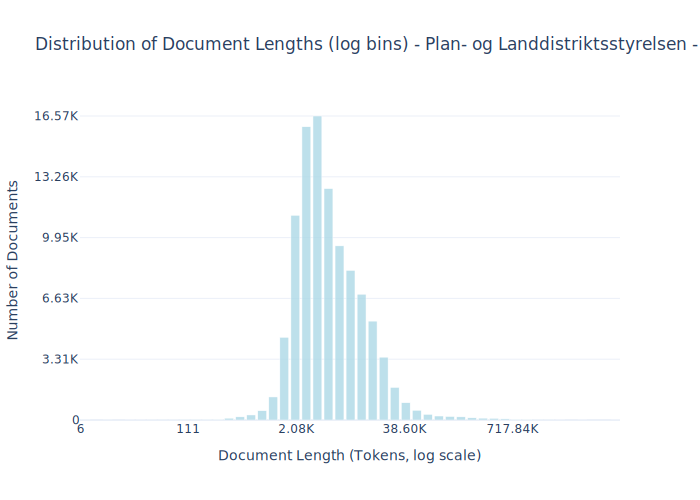

# Dataset Card for Plan- og Landdistriktsstyrelsen - Plandata.dk

<!-- START-SHORT DESCRIPTION -->
A comprehensive dataset consisting of municipal planning documents from across Denmark, including local development plans, municipal plans, planning strategies, and related document types.
<!-- END-SHORT DESCRIPTION -->

This dataset provides access to approximately 114,000 documents pertaining to physical and strategic planning within Danish municipalities. All documents were retrieved from [https://kort.plandata.dk](https://kort.plandata.dk/searchlist/#/search/0165/20/V). The collection includes key planning instruments such as local development plans (lokalplaner), municipal master plans (kommuneplaner), municipal planning strategies (kommuneplanstrategier), and other related documents. Collectively, these define the regulatory framework for land use, urban development, infrastructure, nature conservation, and the allocation of business and residential areas.

Authored and officially adopted by municipal authorities, these documents often possess significant legal weight, making them invaluable for legal, administrative, and urban planning analyses.

**Kommuneplaner (municipal plans)** serve as comprehensive, long-term strategic blueprints for an entire municipality. Spanning multiple years, they establish overarching goals for land use, infrastructure, housing, economic development, and environmental protection, ensuring alignment with both national and regional policies while addressing specific local priorities.

**Lokalplaner (local plans)** offer a more granular perspective, focusing on specific neighborhoods, districts, or individual development projects within a municipality. These plans typically detail zoning regulations, building standards, traffic management solutions, and precise land use specifications for smaller geographical areas.

## Dataset Description

<!-- START-DESC-STATS -->
- **Number of samples**: 101.19K
- **Number of tokens (Llama 3)**: 1.03B
- **Average document length in tokens (min, max)**: 10.20K (6, 13.35M)
<!-- END-DESC-STATS -->

## Dataset Structure
An entry in the dataset consists of the following fields:

- `id` (`str`): An unique identifier for each document.
- `text`(`str`): The content of the document.
- `source` (`str`): The source of the document.
- `added` (`str`): An date for when the document was added to this collection.
- `created` (`str`): An date range for when the document was originally created.
- `token_count` (`int`): The number of tokens in the sample computed using the Llama 8B tokenizer

### Additional Processing

The data have been pulled from [https://kort.plandata.dk](https://kort.plandata.dk/searchlist/#/). 

Each document have been extracted from different file types (docx, pdf, etc.) but primarily PDF.

For text extraction of PDF we have used the [marker](https://github.com/datalab-to/marker) tool. 

### Dataset Statistics

<!-- START-DATASET PLOTS -->

<!-- END-DATASET PLOTS -->

# Additional Information

## License Information
The license for this is a written agreement with "Plan- og Landdistriktsstyrelsen" that we can use the data for training.

> Plan- og Landdistriktsstyrelsen driver Plandata.dk mens det er kommunerne som planlægningsmyndighed, der udarbejder planerne.
>
> Planerne er offentligt tilgængelige, så dem henter I bare.

### Citation Information

No citation available.
