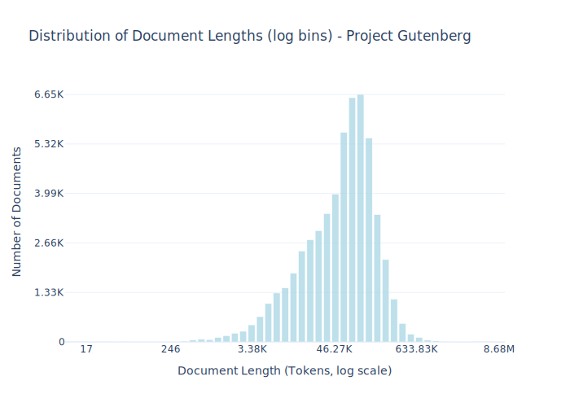

# Dataset Card for Project Gutenberg

<!-- START-SHORT DESCRIPTION -->
All books from project gutenberg marked as english and public domain.
<!-- END-SHORT DESCRIPTION -->

Project Gutenberg is an online collection of over 75,000 digitized books available as plain text. We use all books that are 1) English and 2) marked as in the Public Domain according to the provided metadata. Additionally, we include any books that are part of the PG19 dataset, which only includes books that are over 100 years old. Minimal preprocessing is applied to remove the Project Gutenberg header and footers, but many scanned books include preamble information about who digitized them.


## Dataset Description

<!-- START-DESC-STATS -->
- **Number of samples**: 55.45K
- **Number of tokens (Llama 3)**: 4.91B
- **Average document length in tokens (min, max)**: 88.51K (18, 8.68M)
<!-- END-DESC-STATS -->


## Dataset Structure
An entry in the dataset consists of the following fields:

- `id` (`str`): An unique identifier for each document.
- `text`(`str`): The content of the document.
- `source` (`str`): The source of the document.
- `added` (`str`): An date for when the document was added to this collection.
- `created` (`str`): An date range for when the document was originally created.
- `token_count` (`int`): The number of tokens in the sample computed using the Llama 8B tokenizer


### Additional Processing


### Dataset Statistics

<!-- START-DATASET PLOTS -->
<p align="center">

</p>
<!-- END-DATASET PLOTS -->


# Additional Information

## License Information
While we aim to produce datasets with completely accurate licensing information, license laundering and inaccurate metadata can cause us to erroneously assign the incorrect license to some documents (for further discussion of this limitation, please see our paper). If you believe you have found an instance of incorrect licensing in this dataset, please start a discussion on this repository.


### Citation Information

If you use this dataset, please cite:
```bibtex
@article{kandpal2025common,
  title={{The Common Pile v0.1: An 8TB Dataset of Public Domain and Openly Licensed Text}},
  author={Nikhil Kandpal and Brian Lester and Colin Raffel and Sebastian Majstorovic and Stella Biderman and Baber Abbasi and Luca Soldaini and Enrico Shippole and A. Feder Cooper and Aviya Skowron and Shayne Longpre and Lintang Sutawika and Alon Albalak and Zhenlin Xu and Guilherme Penedo and Loubna Ben  and Elie Bakouch and John David  and Honglu Fan and Dashiell Stander and Guangyu Song and Aaron Gokaslan and John Kirchenbauer and Tom Goldstein and Brian R and Bhavya Kailkhura and Tyler Murray},
  journal={arXiv preprint},
  year={2025}
}
```
```bibtex
@article{raecompressive2019,
  author = {Rae, Jack W and Potapenko, Anna and Jayakumar, Siddhant M and
            Hillier, Chloe and Lillicrap, Timothy P},
  title = {Compressive Transformers for Long-Range Sequence Modelling},
  journal = {arXiv preprint},
  url = {https://arxiv.org/abs/1911.05507},
  year = {2019},
}
```
