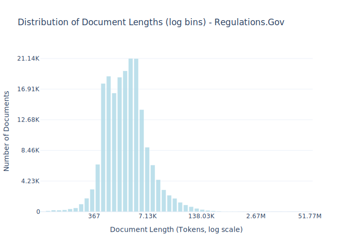

# Dataset Card for Regulations.Gov

<!-- START-SHORT DESCRIPTION -->
This dataset includes all plain-text regulatory documents published by a variety of U.S. federal agencies on Regulations.Gov
<!-- END-SHORT DESCRIPTION -->

Regulations.gov is an online platform operated by the U.S. General Services Administration that collates newly proposed rules and regulations from federal agencies along with comments and feedback from the general public. This dataset includes all plain-text regulatory documents published by a variety of U.S. federal agencies on this platform, acquired via the bulk download interface provided by Regulations.gov. These agencies include the Bureau of Industry and Security (BIS), Department of Transportation (DOT), Environmental Protection Agency (EPA), Federal Aviation Administration (FAA), Food and Drug Administration (FDA), Federal Emergency Management Agency (FEMA), Federal Energy Regulatory Commission (FERC), Federal Motor Carrier Safety Administration (FMCSA), Federal Railroad Administration (FRA), National Highway Traffic Safety Administration (NHTSA), Occupational Safety and Health Administration (OSHA), Pipeline and Hazardous Materials Safety Administration (PHMSA), Securities and Exchange Commission (SEC), and United States Coast Guard (USCG).


## Dataset Description

<!-- START-DESC-STATS -->
- **Number of samples**: 192.44K
- **Number of tokens (Llama 3)**: 1.28B
- **Average document length in tokens (min, max)**: 6.65K (19, 51.77M)
<!-- END-DESC-STATS -->


## Dataset Structure
An entry in the dataset consists of the following fields:

- `id` (`str`): An unique identifier for each document.
- `text`(`str`): The content of the document.
- `source` (`str`): The source of the document (see [Source Data](#source-data)).
- `added` (`str`): An date for when the document was added to this collection.
- `created` (`str`): An date range for when the document was originally created.
- `token_count` (`int`): The number of tokens in the sample computed using the Llama 8B tokenizer


### Additional Processing


### Dataset Statistics

<!-- START-DATASET PLOTS -->
<p align="center">

</p>
<!-- END-DATASET PLOTS -->


# Additional Information

## License Information
While we aim to produce datasets with completely accurate licensing information, license laundering and inaccurate metadata can cause us to erroneously assign the incorrect license to some documents (for further discussion of this limitation, please see our paper). If you believe you have found an instance of incorrect licensing in this dataset, please start a discussion on this repository.

### Citation Information

If you use this dataset, please cite:
```bibtex
@article{kandpal2025common,
  title={{The Common Pile v0.1: An 8TB Dataset of Public Domain and Openly Licensed Text}},
  author={Nikhil Kandpal and Brian Lester and Colin Raffel and Sebastian Majstorovic and Stella Biderman and Baber Abbasi and Luca Soldaini and Enrico Shippole and A. Feder Cooper and Aviya Skowron and Shayne Longpre and Lintang Sutawika and Alon Albalak and Zhenlin Xu and Guilherme Penedo and Loubna Ben  and Elie Bakouch and John David  and Honglu Fan and Dashiell Stander and Guangyu Song and Aaron Gokaslan and John Kirchenbauer and Tom Goldstein and Brian R and Bhavya Kailkhura and Tyler Murray},
  journal={arXiv preprint},
  year={2025}
}
```
