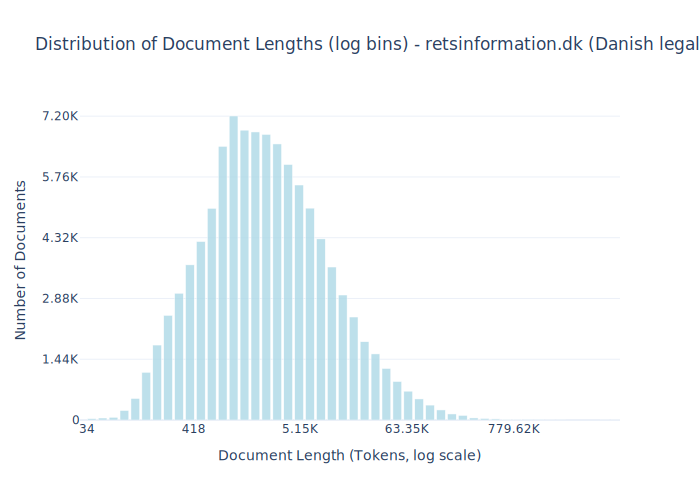

# Dataset Card for retsinformation.dk (Danish legal information)

<!-- START-SHORT DESCRIPTION -->
[retsinformation.dk](https://www.retsinformation.dk) (legal-information.dk) the official legal information system of Denmark. 
<!-- END-SHORT DESCRIPTION -->


It serves as a central repository for Danish legislation, administrative regulations, and other legally binding documents. The platform ensures transparency and public access to laws and legal materials. The sites includes:

1.	**Legislation**: Danish laws, acts, and statutes passed by the Parliament (Folketinget).
2.	**Administrative Regulations**: Rules, guidelines, and executive orders issued by governmental authorities.
3.	**Historical Versions**: Archived versions of laws and regulations, useful for legal research or historical reference.
4.  **Preparatory Works** (Forarbejder): Documents explaining the background and intent behind legislative acts, such as proposals and committee reports.
5.	**Case Law References**: Links to decisions and interpretations that relate to specific legislation.


## Dataset Description


<!-- START-DESC-STATS -->
- **Number of samples**: 100.52K
- **Number of tokens (Llama 3)**: 818.25M
- **Average document length in tokens (min, max)**: 8.14K (34, 9.59M)
<!-- END-DESC-STATS -->


## Dataset Structure
An example from the dataset looks as follows.


<!-- START-SAMPLE -->
```py
{
  "id": "AA014851",
  "text": "Indsamlingsnævnets afgørelse i sag nr. 22-730-00015\n\nIndsamlingsnævnet fandt det kritisabelt, at Gad[...]",
  "source": "retsinformationdk",
  "added": "2025-06-26",
  "created": "2025-06-25, 2025-06-25",
  "token_count": 4062
}
```

### Data Fields

An entry in the dataset consists of the following fields:

- `id` (`str`): An unique identifier for each document.
- `text`(`str`): The content of the document.
- `source` (`str`): The source of the document.
- `added` (`str`): An date for when the document was added to this collection.
- `created` (`str`): An date range for when the document was originally created.
- `token_count` (`int`): The number of tokens in the sample computed using the Llama 8B tokenizer
<!-- END-SAMPLE -->


## License Information
<details>
<summary>Danish Copyright Law</summary>
<p>
Danish Copyright law at https://www.retsinformation.dk/forms/r0710.aspx?id=164796 states 

 § 9. Love, administrative forskrifter, retsafgørelser og lignende offentlige aktstykker er ikke genstand for ophavsret.

Stk. 2. Bestemmelsen i stk. 1 gælder ikke for værker, der fremtræder som selvstændige bidrag i de i stk. 1 nævnte aktstykker. Sådanne værker må dog gengives i forbindelse med aktstykket. Retten til videre udnyttelse afhænger af de i øvrigt gældende regler.

</p>
</details>


### Dataset Statistics

<!-- START-DATASET PLOTS -->
<p align="center">

</p>
<!-- END-DATASET PLOTS -->


## Additional Information


### Citation Information

This dataset was initially published as part of the [Danish gigaword](https://huggingface.co/danish-foundation-models). We recommend that you cite and reference it if you use this dataset:

> Derczynski, L., Ciosici, M. R., et al. (2021). The Danish Gigaword Corpus. In Proceedings of the 23rd Nordic Conference on Computational Linguistics (NoDaLiDa 2021).

```bash
@inproceedings{dagw,
 title = {{The Danish Gigaword Corpus}},
 author = {Leon Derczynski and Manuel R. Ciosici and Rebekah Baglini and Morten H. Christiansen and Jacob Aarup Dalsgaard and Riccardo Fusaroli and Peter Juel Henrichsen and Rasmus Hvingelby and Andreas Kirkedal and Alex Speed Kjeldsen and Claus Ladefoged and Finn Årup Nielsen and Jens Madsen and Malte Lau Petersen and Jonathan Hvithamar Rystrøm and Daniel Varab},
 year = 2021,
 booktitle = {Proceedings of the 23rd Nordic Conference on Computational Linguistics},
 publisher = {NEALT}
}
```
