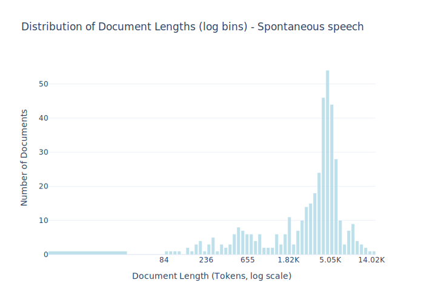

# Dataset Card for Spontaneous speech

<!-- START-SHORT DESCRIPTION -->
Conversational samples collected as a part of research projects at Aarhus University.
<!-- END-SHORT DESCRIPTION -->


The conversational corpus included originates from interdisciplinary research conducted within the [Interacting Minds Centre](https://interactingminds.au.dk), 
and [the Puzzle of Danish project](https://projects.au.dk/the-puzzle-of-danish/) at Aarhus University. Transcribed Danish speech is generally a rare kind of data, 
and spontaneous speech especially so; these manually transcribed conversations thus form a valuable resource. Spontaneous and pseudo-spontaneous conversations 
come from various contexts, e.g., getting to know each other, solving a puzzle together, or making joint decisions. The participants have agreed on 
releasing anonymized transcripts of their conversations. All conversations involve two speakers, sometimes conversing face-to-face, sometimes via a chat tool. 
Speech is transcribed post-hoc by native speakers. Studies published relying on this data include 
[Fusaroli et al. (2012)](https://journals.sagepub.com/doi/10.1177/0956797612436816), 
[Dideriksen et al. (2019)](https://pure.au.dk/ws/portalfiles/portal/167670567/Dideriksen_et_al..pdf), and 
[Tylén et al. (2016)](https://pure.au.dk/ws/portalfiles/portal/101787937/The_Social_Route_To_Abstraction.pdf).


## Dataset Description


<!-- START-DESC-STATS -->
- **Number of samples**: 411
- **Number of tokens (Llama 3)**: 1.56M
- **Average document length in tokens (min, max)**: 3.79K (85, 14.03K)
<!-- END-DESC-STATS -->


## Dataset Structure
An example from the dataset looks as follows.


<!-- START-SAMPLE -->
```py
{
  "id": "spont_PuzzleOfDanish132",
  "text": "Taler 6: mm\nTaler 7: er du klar?\nTaler 6: ja\nTaler 7: så er spørgsmålet om vi skal- om det er sådan [...]",
  "source": "spont",
  "added": "2020-01-21",
  "created": "2019-01-01, 2020-01-01",
  "token_count": 3902
}
```

### Data Fields

An entry in the dataset consists of the following fields:

- `id` (`str`): An unique identifier for each document.
- `text`(`str`): The content of the document.
- `source` (`str`): The source of the document (see [Source Data](#source-data)).
- `added` (`str`): An date for when the document was added to this collection.
- `created` (`str`): An date range for when the document was originally created.
- `token_count` (`int`): The number of tokens in the sample computed using the Llama 8B tokenizer
<!-- END-SAMPLE -->

### Dataset Statistics

<!-- START-DATASET PLOTS -->
<p align="center">

</p>
<!-- END-DATASET PLOTS -->


### Formatting

To represent speakers in the text files, prefix each turn with “TALER 1:” (substituting whatever ID is appropriate). 
Note: there is no space before the colon; use one space after the colon. Speaker IDs should be consistent
throughout all documents in a section. Speaker IDs need only be unique within a section, not universally.

## Additional Information


### Citation Information

This dataset was initially published as part of the [Danish gigaword](https://huggingface.co/danish-foundation-models). We recommend that you cite and reference it if you use this dataset:

> Derczynski, L., Ciosici, M. R., et al. (2021). The Danish Gigaword Corpus. In Proceedings of the 23rd Nordic Conference on Computational Linguistics (NoDaLiDa 2021).

```bash
@inproceedings{dagw,
 title = {{The Danish Gigaword Corpus}},
 author = {Leon Derczynski and Manuel R. Ciosici and Rebekah Baglini and Morten H. Christiansen and Jacob Aarup Dalsgaard and Riccardo Fusaroli and Peter Juel Henrichsen and Rasmus Hvingelby and Andreas Kirkedal and Alex Speed Kjeldsen and Claus Ladefoged and Finn Årup Nielsen and Jens Madsen and Malte Lau Petersen and Jonathan Hvithamar Rystrøm and Daniel Varab},
 year = 2021,
 booktitle = {Proceedings of the 23rd Nordic Conference on Computational Linguistics},
 publisher = {NEALT}
}
```
