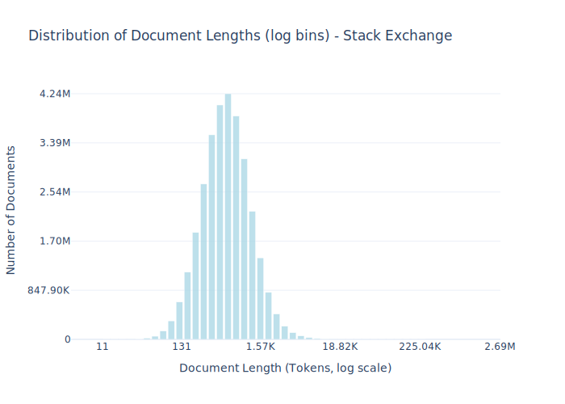

# Dataset Card for Stack Exchange

<!-- START-SHORT DESCRIPTION -->
StackExchange is a collection of Q&A communities spanning a wide variety of topics.
<!-- END-SHORT DESCRIPTION -->

While StackExchange formerly provided structured dumps of all of their content, since July of 2024, StackExchange has stopped publishing XML dumps to the Internet Archive.
Instead, each site can provide a logged-in user with a custom URL to download the dump for that site.
This means that dumps for defunct sites like windowsphone.stackexchange.com are inaccessible.
Additionally, in dumps produced by the new export tool, many questions that are available in past dumps (and accessible on the site) are not present.
For this reason, we extract all questions and answers from community-uploaded dumps from December of 2024 from the Internet Archive and additionally extract missing questions and answers from the last official dumps in July of 2024 to account for the deficiencies listed above.
We use a question, its comments, its answers, and the comments on each answer as a single document.
Following the display order on StackExchange, answers are ordered by the number of votes they received, with the exception that the “accepted answer” always appears first.
PyMarkdown was used to convert each comment into plain text.
Per-document license information is available in the license entry of the metadata field of each example.
Code for collecting, processing, and preparing this dataset is available in the common-pile GitHub repo.


## Dataset Description

<!-- START-DESC-STATS -->
- **Number of samples**: 30.99M
- **Number of tokens (Llama 3)**: 21.83B
- **Average document length in tokens (min, max)**: 704.5059687867861 (11, 2.69M)
<!-- END-DESC-STATS -->


## Dataset Structure
An entry in the dataset consists of the following fields:

- `id` (`str`): An unique identifier for each document.
- `text`(`str`): The content of the document.
- `source` (`str`): The source of the document (see [Source Data](#source-data)).
- `added` (`str`): An date for when the document was added to this collection.
- `created` (`str`): An date range for when the document was originally created.
- `token_count` (`int`): The number of tokens in the sample computed using the Llama 8B tokenizer


### Additional Processing


### Dataset Statistics

<!-- START-DATASET PLOTS -->
<p align="center">

</p>
<!-- END-DATASET PLOTS -->


# Additional Information

## License Information
While we aim to produce datasets with completely accurate licensing information, license laundering and inaccurate metadata can cause us to erroneously assign the incorrect license to some documents (for further discussion of this limitation, please see our paper).
If you believe you have found an instance of incorrect licensing in this dataset, please start a discussion on this repository.

### Citation Information

If you use this dataset, please cite:
```bibtex
@article{kandpal2025common,
  title={{The Common Pile v0.1: An 8TB Dataset of Public Domain and Openly Licensed Text}},
  author={Nikhil Kandpal and Brian Lester and Colin Raffel and Sebastian Majstorovic and Stella Biderman and Baber Abbasi and Luca Soldaini and Enrico Shippole and A. Feder Cooper and Aviya Skowron and Shayne Longpre and Lintang Sutawika and Alon Albalak and Zhenlin Xu and Guilherme Penedo and Loubna Ben  and Elie Bakouch and John David  and Honglu Fan and Dashiell Stander and Guangyu Song and Aaron Gokaslan and John Kirchenbauer and Tom Goldstein and Brian R and Bhavya Kailkhura and Tyler Murray},
  journal={arXiv preprint},
  year={2025}
}
```
