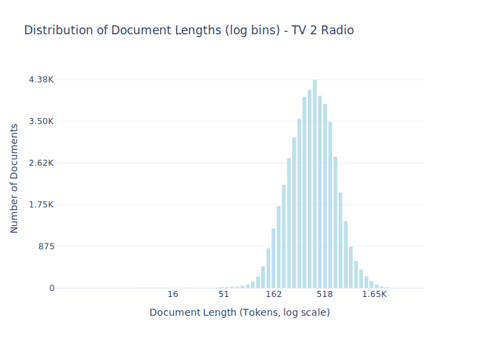

# Dataset Card for TV 2 Radio

## Dataset Description

<!-- START-SHORT DESCRIPTION -->
Contemporary Danish newswire articles published between 2010 and 2019. 
<!-- END-SHORT DESCRIPTION -->


It contains articles of regional interest, written following editorial standards. This section’s value is in both its temporal variation, covering a decade of events, and its spatial variation, covering many local events across most of Denmark (TV2 Bornholm is excluded). As a result of local event coverage, the section contains many locally relevant named entities, which might otherwise not be present in a dataset of national news.


<!-- START-DESC-STATS -->
- **Number of samples**: 49.13K
- **Number of tokens (Llama 3)**: 21.67M
- **Average document length in tokens (min, max)**: 441.055562339724 (16, 5.27K)
<!-- END-DESC-STATS -->


## Dataset Structure
An example from the dataset looks as follows.


<!-- START-SAMPLE -->
```py
{
  "id": "tv2r_92548",
  "text": "Storken er landet\n02 april 2017 kl. 17.58\nSøndag aften er storken Annika landet i sin rede ved Smeda[...]",
  "source": "tv2r",
  "added": "2019-11-13",
  "created": "2015-01-01, 2020-01-01",
  "token_count": 465
}
```

### Data Fields

An entry in the dataset consists of the following fields:

- `id` (`str`): An unique identifier for each document.
- `text`(`str`): The content of the document.
- `source` (`str`): The source of the document (see [Source Data](#source-data)).
- `added` (`str`): An date for when the document was added to this collection.
- `created` (`str`): An date range for when the document was originally created.
- `token_count` (`int`): The number of tokens in the sample computed using the Llama 8B tokenizer
<!-- END-SAMPLE -->


## License Information
<details>
<summary>CC-BY-SA 4.0</summary>
<p>
The owner of this content is TV2 Regionerne, Denmark.
Creative Commons Attribution 4.0 International
</p>
</details>

### Dataset Statistics

<!-- START-DATASET PLOTS -->
<p align="center">

</p>
<!-- END-DATASET PLOTS -->


## Additional Information


### Citation Information

This dataset was initially published as part of the [Danish gigaword](https://huggingface.co/danish-foundation-models). We recommend that you cite and reference it if you use this dataset:

> Derczynski, L., Ciosici, M. R., et al. (2021). The Danish Gigaword Corpus. In Proceedings of the 23rd Nordic Conference on Computational Linguistics (NoDaLiDa 2021).

```bash
@inproceedings{dagw,
 title = {{The Danish Gigaword Corpus}},
 author = {Leon Derczynski and Manuel R. Ciosici and Rebekah Baglini and Morten H. Christiansen and Jacob Aarup Dalsgaard and Riccardo Fusaroli and Peter Juel Henrichsen and Rasmus Hvingelby and Andreas Kirkedal and Alex Speed Kjeldsen and Claus Ladefoged and Finn Årup Nielsen and Jens Madsen and Malte Lau Petersen and Jonathan Hvithamar Rystrøm and Daniel Varab},
 year = 2021,
 booktitle = {Proceedings of the 23rd Nordic Conference on Computational Linguistics},
 publisher = {NEALT}
}
```
