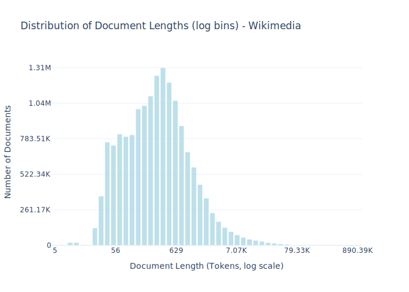

# Dataset Card for Wikimedia

<!-- START-SHORT DESCRIPTION -->
Official Wikimedia wikis are released under a CC BY-SA license.
<!-- END-SHORT DESCRIPTION -->

We downloaded the official database dumps from March 2025 of the English-language wikis that are directly managed by the Wikimedia Foundation. These database dumps include the wikitext—MediaWiki’s custom markup language—for each page as well as talk pages, where editors discuss changes made to a page. We only use the most recent version of each page. We converted wikitext to plain text using wtf_wikipedia after light adjustments in formatting to avoid errors in section ordering caused by a bug. Before parsing, we converted wikitext math into LaTeX math using our custom code. Finally, any remaining HTML tags were removed via regexes. This collection includes data from the following Wikimedia wikis: Wikipedia, Wikinews, Wikibooks, Wikiquote, Wikisource, Wikiversity, Wikivoyage, and Wiktionary.


## Dataset Description

<!-- START-DESC-STATS -->
- **Number of samples**: 16.27M
- **Number of tokens (Llama 3)**: 14.08B
- **Average document length in tokens (min, max)**: 865.3751033306361 (5, 890.39K)
<!-- END-DESC-STATS -->


## Dataset Structure
An entry in the dataset consists of the following fields:

- `id` (`str`): An unique identifier for each document.
- `text`(`str`): The content of the document.
- `source` (`str`): The source of the document (see [Source Data](#source-data)).
- `added` (`str`): An date for when the document was added to this collection.
- `created` (`str`): An date range for when the document was originally created.
- `token_count` (`int`): The number of tokens in the sample computed using the Llama 8B tokenizer


### Additional Processing


### Dataset Statistics

<!-- START-DATASET PLOTS -->
<p align="center">

</p>
<!-- END-DATASET PLOTS -->


# Additional Information

## License Information
While we aim to produce datasets with completely accurate licensing information, license laundering and inaccurate metadata can cause us to erroneously assign the incorrect license to some documents (for further discussion of this limitation, please see our paper). If you believe you have found an instance of incorrect licensing in this dataset, please start a discussion on this repository.

### Citation Information

If you use this dataset, please cite:
```bibtex
@article{kandpal2025common,
  title={{The Common Pile v0.1: An 8TB Dataset of Public Domain and Openly Licensed Text}},
  author={Nikhil Kandpal and Brian Lester and Colin Raffel and Sebastian Majstorovic and Stella Biderman and Baber Abbasi and Luca Soldaini and Enrico Shippole and A. Feder Cooper and Aviya Skowron and Shayne Longpre and Lintang Sutawika and Alon Albalak and Zhenlin Xu and Guilherme Penedo and Loubna Ben  and Elie Bakouch and John David  and Honglu Fan and Dashiell Stander and Guangyu Song and Aaron Gokaslan and John Kirchenbauer and Tom Goldstein and Brian R and Bhavya Kailkhura and Tyler Murray},
  journal={arXiv preprint},
  year={2025}
}
```
