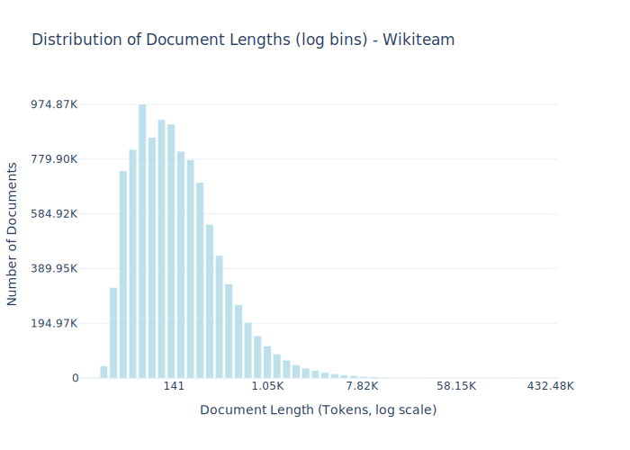

# Dataset Card for Wikiteam

<!-- START-SHORT DESCRIPTION -->
There are many wikis on the internet that are not managed by the Wikimedia Foundation, but do use their MediaWiki software to power their wiki.
<!-- END-SHORT DESCRIPTION -->

There are many wikis on the internet that are not managed by the Wikimedia Foundation, but do use their MediaWiki software to power their wiki. Many of these wikis have been archived by Wikiteam, a collection of volunteers that create unofficial database dumps of wikis and upload them to the Internet Archive. We download all dumps made by Wikiteam when the metadata indicates the wiki was licensed under CC BY, CC BY-SA, or released into the public domain on the Internet Archive as of September of 2024. This results in downloading approximately 330,000 wikis. When multiple dumps of the same wiki exist, we use the most recent dump. We converted wikitext to plain text using wtf_wikipedia after light adjustments in formatting to avoid errors in section ordering caused by a bug. Before parsing, we converted wikitext math into LaTeX math using our custom code. Finally, any remaining HTML tags were removed via regexes. After preprocessing, we removed documents from wikis that appeared to contain large amounts of license laundering, e.g. those that were collections of song lyrics or transcripts. Per-document license information is available in the license entry of the metadata field of each example. Code for collecting, processing, and preparing this dataset is available in the common-pile GitHub repo.


## Dataset Description

<!-- START-DESC-STATS -->
- **Number of samples**: 10.23M
- **Number of tokens (Llama 3)**: 2.94B
- **Average document length in tokens (min, max)**: 287.8559942189961 (19, 432.48K)
<!-- END-DESC-STATS -->


## Dataset Structure
An entry in the dataset consists of the following fields:

- `id` (`str`): An unique identifier for each document.
- `text`(`str`): The content of the document.
- `source` (`str`): The source of the document (see [Source Data](#source-data)).
- `added` (`str`): An date for when the document was added to this collection.
- `created` (`str`): An date range for when the document was originally created.
- `token_count` (`int`): The number of tokens in the sample computed using the Llama 8B tokenizer


### Additional Processing


### Dataset Statistics

<!-- START-DATASET PLOTS -->
<p align="center">

</p>
<!-- END-DATASET PLOTS -->


# Additional Information

## License Information
While we aim to produce datasets with completely accurate licensing information, license laundering and inaccurate metadata can cause us to erroneously assign the incorrect license to some documents (for further discussion of this limitation, please see our paper). If you believe you have found an instance of incorrect licensing in this dataset, please start a discussion on this repository.

### Citation Information

If you use this dataset, please cite:
```bibtex
@article{kandpal2025common,
  title={{The Common Pile v0.1: An 8TB Dataset of Public Domain and Openly Licensed Text}},
  author={Nikhil Kandpal and Brian Lester and Colin Raffel and Sebastian Majstorovic and Stella Biderman and Baber Abbasi and Luca Soldaini and Enrico Shippole and A. Feder Cooper and Aviya Skowron and Shayne Longpre and Lintang Sutawika and Alon Albalak and Zhenlin Xu and Guilherme Penedo and Loubna Ben  and Elie Bakouch and John David  and Honglu Fan and Dashiell Stander and Guangyu Song and Aaron Gokaslan and John Kirchenbauer and Tom Goldstein and Brian R and Bhavya Kailkhura and Tyler Murray},
  journal={arXiv preprint},
  year={2025}
}
```
