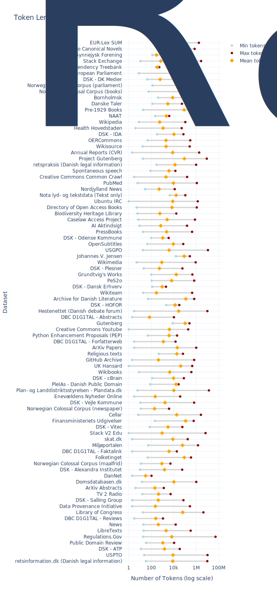
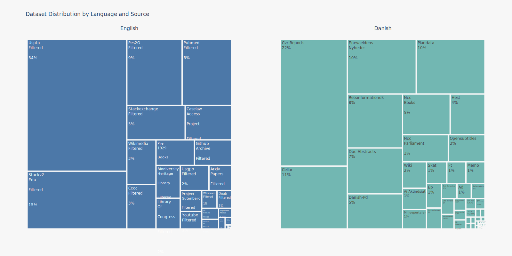
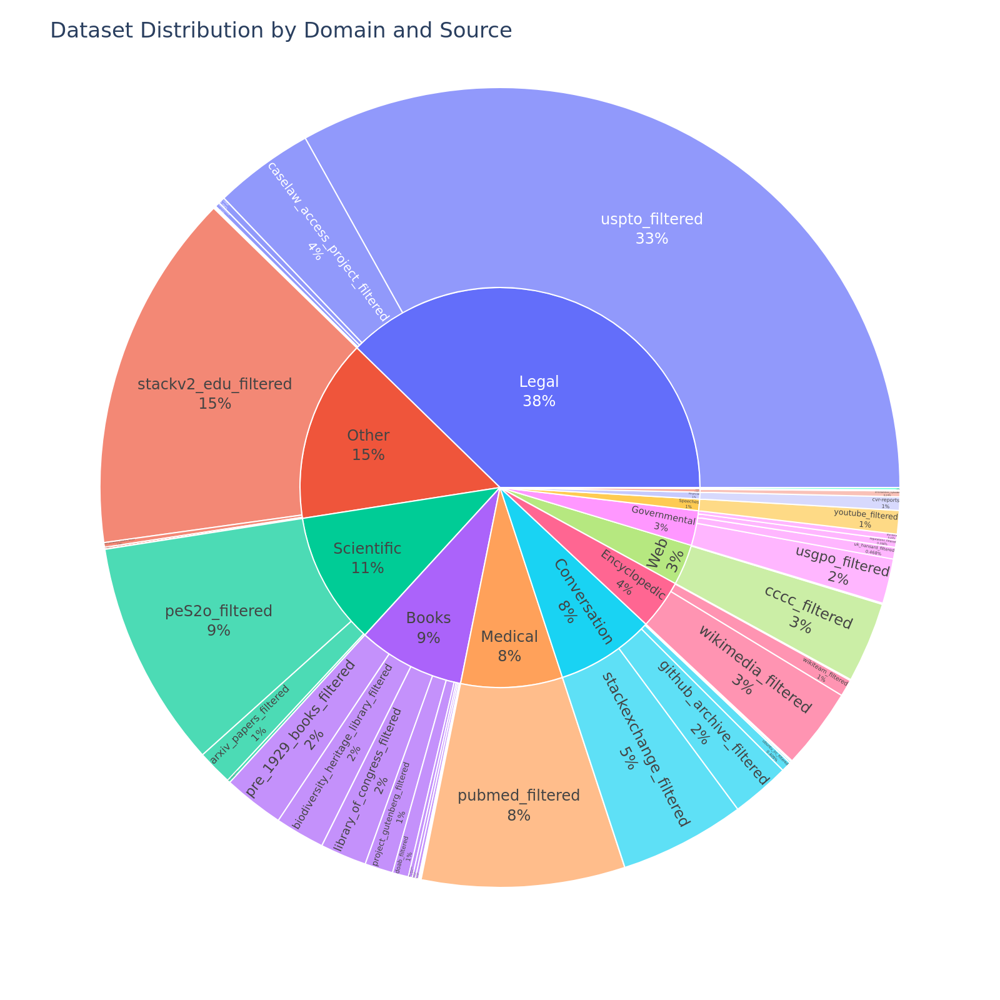

# DFM Data: A Composite Dataset for Danish LLMs.

This page provides a detailed description of the composite dataset used to train large language models developed by Danish Foundation Models. The dataset is curated to offer a diverse and comprehensive corpus across multiple domains, including legal, financial, and literary texts, with the primary intention of developing language models for Danish.

## Dataset Description

### Summary

The DFM Data is a collection of datasets used for [Danish Foundation Models](https://www.foundationmodels.dk). This repository ensure documentation to data along with FAIR data practices.

### Curation Rationale

These datasets were collected and curated with the intention of developing language models for Danish.

### Data Collection and Processing
The dataset was constructed by collecting and integrating text from a wide variety of public and partner-provided sources. The raw data was subjected to a standardized cleaning pipeline, which included steps such as deduplication, filtering of low-quality content to prepare it for large-scale language model training.

### Dataset Statistics

<!-- START-DESC-STATS -->
- **Number of samples**: 230.07M
- **Number of tokens (Llama 3)**: 430.24B
- **Average document length in tokens (min, max)**: 1.87K (1, 51.77M)
<!-- END-DESC-STATS -->

The following plot pr. dataset histograms displaying document lengths.

<!-- START-DATASET PLOTS -->

<!-- END-DATASET PLOTS -->

### Languages
This dataset includes the following languages:

- Danish
- English
- Swedish
- Norwegian Bokmål
- Norwegian Nynorsk

Below is a visualisation of the main languages in each of the datasets.

### Domains

This dataset consist of data from various domains (e.g., legal, books, social media). The following table and figure give an overview of the relative distributions of these domains.

<!-- START-DOMAIN TABLE -->

<table>
<thead>
<tr>
<th style="text-align: left;">Domain</th>
<th style="text-align: left;">Sources</th>
<th style="text-align: left;">N. Tokens</th>
</tr>
</thead>
<tbody>
<tr>
<td style="text-align: left;">Legal</td>
<td style="text-align: left;"><a href="data/retsinformationdk/retsinformationdk.html">retsinformationdk</a>, <a href="data/retspraksis/retspraksis.html">retspraksis</a>, <a href="data/skat/skat.html">skat</a>, <a href="data/fm-udgivelser/fm-udgivelser.html">fm-udgivelser</a>, <a href="data/eur-lex-sum-da/eur-lex-sum-da.html">eur-lex-sum-da</a>, <a href="data/miljoeportalen/miljoeportalen.html">miljoeportalen</a>, <a href="data/cellar/cellar.html">cellar</a>, <a href="data/domsdatabasen/domsdatabasen.html">domsdatabasen</a>, <a href="data/caselaw_access_project_filtered/caselaw_access_project_filtered.html">caselaw_access_project_filtered</a>, <a href="data/uspto_filtered/uspto_filtered.html">uspto_filtered</a></td>
<td style="text-align: left;">162.19B</td>
</tr>
<tr>
<td style="text-align: left;">Other</td>
<td style="text-align: left;"><a href="data/dannet/dannet.html">dannet</a>, <a href="data/depbank/depbank.html">depbank</a>, <a href="data/synne/synne.html">synne</a>, <a href="data/dsk-cbrain/dsk-cbrain.html">dsk-cbrain</a>, <a href="data/dsk-hofor/dsk-hofor.html">dsk-hofor</a>, <a href="data/dsk-plesner/dsk-plesner.html">dsk-plesner</a>, <a href="data/dsk-vitec/dsk-vitec.html">dsk-vitec</a>, <a href="data/ncc_parliament/ncc_parliament.html">ncc_parliament</a>, <a href="data/data_provenance_initiative_filtered/data_provenance_initiative_filtered.html">data_provenance_initiative_filtered</a>, <a href="data/public_domain_review_filtered/public_domain_review_filtered.html">public_domain_review_filtered</a>, <a href="data/stackv2_edu_filtered/stackv2_edu_filtered.html">stackv2_edu_filtered</a></td>
<td style="text-align: left;">63.56B</td>
</tr>
<tr>
<td style="text-align: left;">Scientific</td>
<td style="text-align: left;"><a href="data/arxiv_abstracts_filtered/arxiv_abstracts_filtered.html">arxiv_abstracts_filtered</a>, <a href="data/arxiv_papers_filtered/arxiv_papers_filtered.html">arxiv_papers_filtered</a>, <a href="data/peS2o_filtered/peS2o_filtered.html">peS2o_filtered</a></td>
<td style="text-align: left;">46.15B</td>
</tr>
<tr>
<td style="text-align: left;">Books</td>
<td style="text-align: left;"><a href="data/adl/adl.html">adl</a>, <a href="data/gutenberg/gutenberg.html">gutenberg</a>, <a href="data/jvj/jvj.html">jvj</a>, <a href="data/relig/relig.html">relig</a>, <a href="data/wikibooks/wikibooks.html">wikibooks</a>, <a href="data/memo/memo.html">memo</a>, <a href="data/ncc_books/ncc_books.html">ncc_books</a>, <a href="data/dbc-abstracts/dbc-abstracts.html">dbc-abstracts</a>, <a href="data/dbc-reviews/dbc-reviews.html">dbc-reviews</a>, <a href="data/danish-pd/danish-pd.html">danish-pd</a>, <a href="data/grundtvig/grundtvig.html">grundtvig</a>, <a href="data/biodiversity_heritage_library_filtered/biodiversity_heritage_library_filtered.html">biodiversity_heritage_library_filtered</a>, <a href="data/doab_filtered/doab_filtered.html">doab_filtered</a>, <a href="data/library_of_congress_filtered/library_of_congress_filtered.html">library_of_congress_filtered</a>, <a href="data/libretexts_filtered/libretexts_filtered.html">libretexts_filtered</a>, <a href="data/oercommons_filtered/oercommons_filtered.html">oercommons_filtered</a>, <a href="data/pre_1929_books_filtered/pre_1929_books_filtered.html">pre_1929_books_filtered</a>, <a href="data/pressbooks_filtered/pressbooks_filtered.html">pressbooks_filtered</a>, <a href="data/project_gutenberg_filtered/project_gutenberg_filtered.html">project_gutenberg_filtered</a></td>
<td style="text-align: left;">37.19B</td>
</tr>
<tr>
<td style="text-align: left;">Medical</td>
<td style="text-align: left;"><a href="data/health_hovedstaden/health_hovedstaden.html">health_hovedstaden</a>, <a href="data/pubmed_filtered/pubmed_filtered.html">pubmed_filtered</a></td>
<td style="text-align: left;">35.35B</td>
</tr>
<tr>
<td style="text-align: left;">Conversation</td>
<td style="text-align: left;"><a href="data/ep/ep.html">ep</a>, <a href="data/ft/ft.html">ft</a>, <a href="data/naat/naat.html">naat</a>, <a href="data/spont/spont.html">spont</a>, <a href="data/danske-taler/danske-taler.html">danske-taler</a>, <a href="data/opensubtitles/opensubtitles.html">opensubtitles</a>, <a href="data/github_archive_filtered/github_archive_filtered.html">github_archive_filtered</a>, <a href="data/stackexchange_filtered/stackexchange_filtered.html">stackexchange_filtered</a>, <a href="data/ubuntu_irc_filtered/ubuntu_irc_filtered.html">ubuntu_irc_filtered</a></td>
<td style="text-align: left;">34.30B</td>
</tr>
<tr>
<td style="text-align: left;">Encyclopedic</td>
<td style="text-align: left;"><a href="data/wiki/wiki.html">wiki</a>, <a href="data/wikisource/wikisource.html">wikisource</a>, <a href="data/dbc-faktalink/dbc-faktalink.html">dbc-faktalink</a>, <a href="data/dbc-forfatterweb/dbc-forfatterweb.html">dbc-forfatterweb</a>, <a href="data/wikimedia_filtered/wikimedia_filtered.html">wikimedia_filtered</a>, <a href="data/wikiteam_filtered/wikiteam_filtered.html">wikiteam_filtered</a></td>
<td style="text-align: left;">17.21B</td>
</tr>
<tr>
<td style="text-align: left;">Web</td>
<td style="text-align: left;"><a href="data/dsk-alexandra/dsk-alexandra.html">dsk-alexandra</a>, <a href="data/dsk-atp/dsk-atp.html">dsk-atp</a>, <a href="data/dsk-salling/dsk-salling.html">dsk-salling</a>, <a href="data/dsk-vejle/dsk-vejle.html">dsk-vejle</a>, <a href="data/ai-aktindsigt/ai-aktindsigt.html">ai-aktindsigt</a>, <a href="data/ncc_maalfrid/ncc_maalfrid.html">ncc_maalfrid</a>, <a href="data/cccc_filtered/cccc_filtered.html">cccc_filtered</a></td>
<td style="text-align: left;">14.20B</td>
</tr>
<tr>
<td style="text-align: left;">Governmental</td>
<td style="text-align: left;"><a href="data/plandata/plandata.html">plandata</a>, <a href="data/regulations_filtered/regulations_filtered.html">regulations_filtered</a>, <a href="data/uk_hansard_filtered/uk_hansard_filtered.html">uk_hansard_filtered</a>, <a href="data/usgpo_filtered/usgpo_filtered.html">usgpo_filtered</a></td>
<td style="text-align: left;">12.10B</td>
</tr>
<tr>
<td style="text-align: left;">Speeches</td>
<td style="text-align: left;"><a href="data/youtube_filtered/youtube_filtered.html">youtube_filtered</a></td>
<td style="text-align: left;">4.07B</td>
</tr>
<tr>
<td style="text-align: left;">Financial</td>
<td style="text-align: left;"><a href="data/cvr-reports/cvr-reports.html">cvr-reports</a></td>
<td style="text-align: left;">2.32B</td>
</tr>
<tr>
<td style="text-align: left;">News</td>
<td style="text-align: left;"><a href="data/tv2r/tv2r.html">tv2r</a>, <a href="data/dsk-danskerhverv/dsk-danskerhverv.html">dsk-danskerhverv</a>, <a href="data/dsk-dkmedier/dsk-dkmedier.html">dsk-dkmedier</a>, <a href="data/dsk-ida/dsk-ida.html">dsk-ida</a>, <a href="data/dsk-odense/dsk-odense.html">dsk-odense</a>, <a href="data/nordjyllandnews/nordjyllandnews.html">nordjyllandnews</a>, <a href="data/ncc_newspaper/ncc_newspaper.html">ncc_newspaper</a>, <a href="data/enevaeldens_nyheder/enevaeldens_nyheder.html">enevaeldens_nyheder</a>, <a href="data/news_filtered/news_filtered.html">news_filtered</a></td>
<td style="text-align: left;">1.22B</td>
</tr>
<tr>
<td style="text-align: left;">Social Media</td>
<td style="text-align: left;"><a href="data/hest/hest.html">hest</a></td>
<td style="text-align: left;">389.32M</td>
</tr>
<tr>
<td style="text-align: left;">Readaloud</td>
<td style="text-align: left;"><a href="data/nota/nota.html">nota</a></td>
<td style="text-align: left;">7.30M</td>
</tr>
<tr>
<td style="text-align: left;">Technical</td>
<td style="text-align: left;"><a href="data/python_enhancement_proposals_filtered/python_enhancement_proposals_filtered.html">python_enhancement_proposals_filtered</a></td>
<td style="text-align: left;">2.54M</td>
</tr>
<tr>
<td style="text-align: left;">Dialect</td>
<td style="text-align: left;"><a href="data/botxt/botxt.html">botxt</a></td>
<td style="text-align: left;">847.97K</td>
</tr>
<tr>
<td style="text-align: left;"><strong>Total</strong></td>
<td style="text-align: left;"></td>
<td style="text-align: left;">430.24B</td>
</tr>
</tbody>
</table>

<!-- END-DOMAIN TABLE -->

### Licensing

The following gives an overview of the licensing in the DFMv1. To get the exact license of the individual datasets check out the individual datasets by clicking the links in the table.
These license is applied to the constituent data, i.e., the text. The collection of datasets (metadata, quality control, etc.) is licensed under [CC-0](https://creativecommons.org/publicdomain/zero/1.0/legalcode.en).

<!-- START-LICENSE TABLE -->

<table>
<thead>
<tr>
<th style="text-align: left;">License</th>
<th style="text-align: left;">Sources</th>
<th style="text-align: left;">N. Tokens</th>
</tr>
</thead>
<tbody>
<tr>
<td style="text-align: left;">Public Domain</td>
<td style="text-align: left;"><a href="data/danish-pd/danish-pd.html">danish-pd</a>, <a href="data/python_enhancement_proposals_filtered/python_enhancement_proposals_filtered.html">python_enhancement_proposals_filtered</a>, <a href="data/regulations_filtered/regulations_filtered.html">regulations_filtered</a>, <a href="data/ubuntu_irc_filtered/ubuntu_irc_filtered.html">ubuntu_irc_filtered</a>, <a href="data/usgpo_filtered/usgpo_filtered.html">usgpo_filtered</a>, <a href="data/uspto_filtered/uspto_filtered.html">uspto_filtered</a></td>
<td style="text-align: left;">153.74B</td>
</tr>
<tr>
<td style="text-align: left;">CC-BY-SA 4.0</td>
<td style="text-align: left;"><a href="data/depbank/depbank.html">depbank</a>, <a href="data/jvj/jvj.html">jvj</a>, <a href="data/tv2r/tv2r.html">tv2r</a>, <a href="data/fm-udgivelser/fm-udgivelser.html">fm-udgivelser</a>, <a href="data/eur-lex-sum-da/eur-lex-sum-da.html">eur-lex-sum-da</a>, <a href="data/memo/memo.html">memo</a>, <a href="data/cellar/cellar.html">cellar</a>, <a href="data/doab_filtered/doab_filtered.html">doab_filtered</a>, <a href="data/libretexts_filtered/libretexts_filtered.html">libretexts_filtered</a>, <a href="data/news_filtered/news_filtered.html">news_filtered</a>, <a href="data/oercommons_filtered/oercommons_filtered.html">oercommons_filtered</a>, <a href="data/peS2o_filtered/peS2o_filtered.html">peS2o_filtered</a>, <a href="data/pressbooks_filtered/pressbooks_filtered.html">pressbooks_filtered</a>, <a href="data/public_domain_review_filtered/public_domain_review_filtered.html">public_domain_review_filtered</a>, <a href="data/pubmed_filtered/pubmed_filtered.html">pubmed_filtered</a>, <a href="data/stackexchange_filtered/stackexchange_filtered.html">stackexchange_filtered</a>, <a href="data/wikimedia_filtered/wikimedia_filtered.html">wikimedia_filtered</a>, <a href="data/wikiteam_filtered/wikiteam_filtered.html">wikiteam_filtered</a>, <a href="data/youtube_filtered/youtube_filtered.html">youtube_filtered</a></td>
<td style="text-align: left;">122.21B</td>
</tr>
<tr>
<td style="text-align: left;">CC-0</td>
<td style="text-align: left;"><a href="data/adl/adl.html">adl</a>, <a href="data/botxt/botxt.html">botxt</a>, <a href="data/ep/ep.html">ep</a>, <a href="data/ft/ft.html">ft</a>, <a href="data/hest/hest.html">hest</a>, <a href="data/naat/naat.html">naat</a>, <a href="data/relig/relig.html">relig</a>, <a href="data/retspraksis/retspraksis.html">retspraksis</a>, <a href="data/skat/skat.html">skat</a>, <a href="data/spont/spont.html">spont</a>, <a href="data/synne/synne.html">synne</a>, <a href="data/wiki/wiki.html">wiki</a>, <a href="data/wikibooks/wikibooks.html">wikibooks</a>, <a href="data/wikisource/wikisource.html">wikisource</a>, <a href="data/danske-taler/danske-taler.html">danske-taler</a>, <a href="data/miljoeportalen/miljoeportalen.html">miljoeportalen</a>, <a href="data/nordjyllandnews/nordjyllandnews.html">nordjyllandnews</a>, <a href="data/nota/nota.html">nota</a>, <a href="data/opensubtitles/opensubtitles.html">opensubtitles</a>, <a href="data/ncc_books/ncc_books.html">ncc_books</a>, <a href="data/ncc_newspaper/ncc_newspaper.html">ncc_newspaper</a>, <a href="data/health_hovedstaden/health_hovedstaden.html">health_hovedstaden</a>, <a href="data/grundtvig/grundtvig.html">grundtvig</a>, <a href="data/enevaeldens_nyheder/enevaeldens_nyheder.html">enevaeldens_nyheder</a>, <a href="data/arxiv_abstracts_filtered/arxiv_abstracts_filtered.html">arxiv_abstracts_filtered</a>, <a href="data/arxiv_papers_filtered/arxiv_papers_filtered.html">arxiv_papers_filtered</a>, <a href="data/biodiversity_heritage_library_filtered/biodiversity_heritage_library_filtered.html">biodiversity_heritage_library_filtered</a>, <a href="data/caselaw_access_project_filtered/caselaw_access_project_filtered.html">caselaw_access_project_filtered</a>, <a href="data/cccc_filtered/cccc_filtered.html">cccc_filtered</a>, <a href="data/data_provenance_initiative_filtered/data_provenance_initiative_filtered.html">data_provenance_initiative_filtered</a>, <a href="data/library_of_congress_filtered/library_of_congress_filtered.html">library_of_congress_filtered</a>, <a href="data/pre_1929_books_filtered/pre_1929_books_filtered.html">pre_1929_books_filtered</a>, <a href="data/project_gutenberg_filtered/project_gutenberg_filtered.html">project_gutenberg_filtered</a></td>
<td style="text-align: left;">74.04B</td>
</tr>
<tr>
<td style="text-align: left;">Various - MIT, BSD-3-Clause, Apache-2.0, etc.</td>
<td style="text-align: left;"><a href="data/github_archive_filtered/github_archive_filtered.html">github_archive_filtered</a>, <a href="data/stackv2_edu_filtered/stackv2_edu_filtered.html">stackv2_edu_filtered</a></td>
<td style="text-align: left;">72.60B</td>
</tr>
<tr>
<td style="text-align: left;">Verbal agreement</td>
<td style="text-align: left;"><a href="data/cvr-reports/cvr-reports.html">cvr-reports</a></td>
<td style="text-align: left;">2.32B</td>
</tr>
<tr>
<td style="text-align: left;">Open Parliament License</td>
<td style="text-align: left;"><a href="data/uk_hansard_filtered/uk_hansard_filtered.html">uk_hansard_filtered</a></td>
<td style="text-align: left;">2.01B</td>
</tr>
<tr>
<td style="text-align: left;">Written agreement (public models, private data)</td>
<td style="text-align: left;"><a href="data/plandata/plandata.html">plandata</a>, <a href="data/dbc-abstracts/dbc-abstracts.html">dbc-abstracts</a>, <a href="data/dbc-faktalink/dbc-faktalink.html">dbc-faktalink</a>, <a href="data/dbc-forfatterweb/dbc-forfatterweb.html">dbc-forfatterweb</a>, <a href="data/dbc-reviews/dbc-reviews.html">dbc-reviews</a></td>
<td style="text-align: left;">1.78B</td>
</tr>
<tr>
<td style="text-align: left;">Other (No attribution required)</td>
<td style="text-align: left;"><a href="data/retsinformationdk/retsinformationdk.html">retsinformationdk</a>, <a href="data/domsdatabasen/domsdatabasen.html">domsdatabasen</a></td>
<td style="text-align: left;">904.61M</td>
</tr>
<tr>
<td style="text-align: left;">Other (Attribution required)</td>
<td style="text-align: left;"><a href="data/dannet/dannet.html">dannet</a>, <a href="data/gutenberg/gutenberg.html">gutenberg</a>, <a href="data/ai-aktindsigt/ai-aktindsigt.html">ai-aktindsigt</a>, <a href="data/ncc_maalfrid/ncc_maalfrid.html">ncc_maalfrid</a>, <a href="data/ncc_parliament/ncc_parliament.html">ncc_parliament</a></td>
<td style="text-align: left;">515.61M</td>
</tr>
<tr>
<td style="text-align: left;">DSK-1</td>
<td style="text-align: left;"><a href="data/dsk-alexandra/dsk-alexandra.html">dsk-alexandra</a>, <a href="data/dsk-atp/dsk-atp.html">dsk-atp</a>, <a href="data/dsk-cbrain/dsk-cbrain.html">dsk-cbrain</a>, <a href="data/dsk-danskerhverv/dsk-danskerhverv.html">dsk-danskerhverv</a>, <a href="data/dsk-dkmedier/dsk-dkmedier.html">dsk-dkmedier</a>, <a href="data/dsk-hofor/dsk-hofor.html">dsk-hofor</a>, <a href="data/dsk-ida/dsk-ida.html">dsk-ida</a>, <a href="data/dsk-odense/dsk-odense.html">dsk-odense</a>, <a href="data/dsk-plesner/dsk-plesner.html">dsk-plesner</a>, <a href="data/dsk-salling/dsk-salling.html">dsk-salling</a>, <a href="data/dsk-vejle/dsk-vejle.html">dsk-vejle</a>, <a href="data/dsk-vitec/dsk-vitec.html">dsk-vitec</a></td>
<td style="text-align: left;">113.35M</td>
</tr>
<tr>
<td style="text-align: left;"><strong>Total</strong></td>
<td style="text-align: left;"></td>
<td style="text-align: left;">430.24B</td>
</tr>
</tbody>
</table>

<!-- END-LICENSE TABLE -->

## Additional Information

### Citation Information

If you use a model trained on this dataset, please cite the associated DFM project or research paper when it becomes available. A BibTeX entry will be provided here upon the official release of a corresponding paper.

###  Disclaimer
We do not own any of the text from which the data has been extracted.
If you believe that we are not allowed to train on any of the datasets noted please do [contact us](https://github.com/danish-foundation-models/dfm-datasheets/issues).

### Notice and take down policy
Notice: Should you consider that our data contains material that is owned by you and should therefore not be included in the training of LLMs here, please:

- Clearly identify yourself, with detailed contact data such as an address, telephone number or email address at which you can be contacted.
- Clearly identify the copyrighted work claimed to be infringed.
- Clearly identify the material that is claimed to be infringing and information reasonably sufficient to allow us to locate the material.

You can contact us by making an [issue](https://github.com/danish-foundation-models/dfm-datasheets/issues).

Take down: We will comply to legitimate requests by removing the affected sources from the next release of the corpus.

---

<h3 style="display: flex; align-items: center;">
  
  A&nbsp;<a href=https://www.foundationmodels.dk>Danish Foundation Models</a>&nbsp;dataset
</h3>
