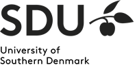
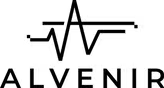
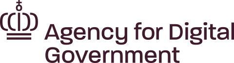

# Empowering the Danish Language in the Digital Age

Welcome to the Danish Foundation Models (DFM) project, a pioneering initiative in the field of machine learning and natural language processing (NLP) dedicated to the Danish language. Our mission is to develop, maintain, and provide open access to high-quality foundation models tailored for Danish, promoting innovation and inclusivity in language technologies.

!!! abstract "Read the paper"

    You can read more about the argument for Danish Language models in our [publication](https://arxiv.org/abs/2311.07264).

## Why Danish Foundation Models?

### Bridging the Digital Language Divide

- **Global Gap**: The rise of large language models has transformed research and technology, but smaller languages like Danish risk falling behind both in development, evaluation and application.
- **Local Focus**: We combat this by focusing on the Danish language, ensuring that it is well-represented in the digital landscape.
- **Broad Collaboration**: Our project unites public and private institutions, ensuring high data quality and practical applicability of our models.

## Our Objectives

1. To develop and maintain **state-of-the-art language models for Danish** for applications within both text and speech.
2. To extensively **validate** foundation models for Danish in a representative set of tasks.
3. To maintain a high standard of **documentation** of models such as model cards \[[Mitchell et al., 2019](https://arxiv.org/abs/1810.03993)\] and datasheets \[[Gebru et al., 2021](https://cacm.acm.org/magazines/2021/12/256932-datasheets-for-datasets/abstract)\].
4. To **open-source** not only the models but also all components required for reproducibility such as pre-processing, training, and validation code.

## Open-source

###  Open-source Development with Privacy-Focused Data Handling

In our commitment to advancing open-source development, we strongly emphasise the ethical handling of data, particularly when it involves personally sensitive information or material under copyright. This ensures that we share as much as possible while protecting privacy.

To achieve this, our project is structured to differentiate between data that can be shared openly and that which cannot. 
This demarcation is documented through detailed datasheets and training logs, thereby ensuring transparency in our processes.

Additionally, we prioritise the security of the data during its processing and training phases. All data is stored on UCloud, a platform that upholds the recognised highest standards in information security management. This commitment to data security is exemplified by UCloud's adherence to ISO27001, a globally recognised standard, ensuring that our data handling practices meet rigorous international criteria. For more information on our security measures, please visit UCloud's security [documentation](https://docs.cloud.sdu.dk/intro/security.html).

### Contributions

Besides our [models](https://www.foundationmodels.dk/models/) DFM has led to a series of positive open-source contributions, the following table include some of these contributions:

| Project                                                                                                                                                                                                                                                                            | Contribution                                                                                                                |
| ---------------------------------------------------------------------------------------------------------------------------------------------------------------------------------------------------------------------------------------------------------------------------------- | --------------------------------------------------------------------------------------------------------------------------- |
| **Packages**                                                                                                                                                                                                                                                                       |                                                                                                                             |
| [NLPDedup](https://github.com/saattrupdan/NLPDedup)                                                                                                                                                                                                                                | A deduplication library derived from DFM's deduplication code                                                               |
| **Code contributions**                                                                                                                                                                                                                                                             |                                                                                                                             |
| [TextDescriptives](https://hlasse.github.io/TextDescriptives/)                                                                                                                                                                                                                     | Added heuristic quality measure for texts                                                                                   |
| [dolma](https://github.com/allenai/dolma)                                                                                                                                                                                                                                          | Bugfixes and addition of taggers for filtering                                                                              |
| **Benchmarks**                                                                                                                                                                                                                                                                     |                                                                                                                             |
| [ScandEval](https://scandeval.com)                                                                                                                                                                                                                                                 | Co-contributors have significant contributions to developing NLU and NLG benchmarks for Scandinavian and Germanic languages |
| [Scandinavian Embedding Benchmark](https://kennethenevoldsen.github.io/scandinavian-embedding-benchmark/)                                                                                                                                                                          | The benchmark for evaluating Scandinavian embedding has been created as a part of DFM                                       |
| **Datasets**                                                                                                                                                                                                                                                                       |                                                                                                                             |
| [m_arc](https://huggingface.co/datasets/alexandrainst/m_arc), [m_mmlu](https://huggingface.co/datasets/alexandrainst/m_mmlu), [m_hellaswag](https://huggingface.co/datasets/alexandrainst/m_hellaswag), [m_truthfulqa](https://huggingface.co/datasets/alexandrainst/m_truthfulqa) | Translated versions of English datasets intended for model evaluation for these domains                                     |

## Improving the Danish Language Technology Landscape

The Danish Foundations models is a collaboration across Danish universities and research organizations. The project engages with data science communities and initiatives ([Danish Data Science Community](https://danskdatascience.dk/)), to promote the development of Danish language tools. We continually gather information about how to improve the Danish language technologies and how to best support the community. If you want to highlight missing pieces in Danish NLP we invite you to open a thread on the [forum](https://github.com/centre-for-humanities-computing/danish-foundation-models/discussions/categories/missing-pieces-for-danish-nlp) stating the problems and potential solutions.

## The Core Team
Those with data access, who contribute to the project, including data management, model development, project management, and more.

  

    
    
    
    
    
    <!-- Duplicated for now to make it seamless, but if we add more we don't need it -->
        
    
    
    
    
  

## Collaborators and Contributors

Collaborators and contributors who have supported the project through data contributions, model evaluations, benchmarking, and other valuable inputs. This does not include funding bodies.

  

    
    
    
        <!-- Duplicated for now to make it seamless, but if we add more we don't need it -->
        
    
    
        
    
    
  

## Join Us

We invite collaboration and contributions from industry professionals, researchers, and the open-source community. Together, we can advance the field of Danish NLP and create a more inclusive digital future. You can reach out to us using the following channels:

|                                                                                                                                                                         |                                                                                                                            |
| ----------------------------------------------------------------------------------------------------------------------------------------------------------------------- | -------------------------------------------------------------------------------------------------------------------------- |
| :octicons-people-24: - [**DDSC Slack**](https://join.slack.com/t/danskdatascie-o8m9638/shared_invite/zt-1jh2dwmj4-D_mjywfXERvVP75n9O0ykg)                               | Join the discussion in the "danish-foundation-models-text"-channel                                                         |
| :octicons-comment-discussion-24: -  [**GitHub Discussion**](https://github.com/centre-for-humanities-computing/danish-foundation-models/discussions)                    | Ask questions or start a discussion                                                                                        |
| :octicons-issue-tracks-24: - [**GitHub Issues**](https://github.com/centre-for-humanities-computing/danish-foundation-models/issues)                                    | Noticed a bug in the code? Please create an issue                                                                          |
| :octicons-feed-rocket-16: - [**Using the model?**](https://github.com/centre-for-humanities-computing/danish-foundation-models/discussions/categories/using-our-models) | If you use the model, let us know it makes it easier for us to apply for funding and justify the devopment of the project. |

[Contact us :fontawesome-solid-paper-plane:](mailto:kenneth.enevoldsen@cas.au.dk){ .md-button }
