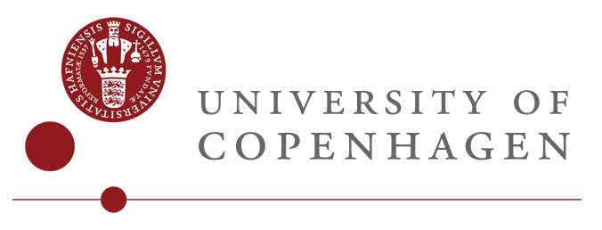
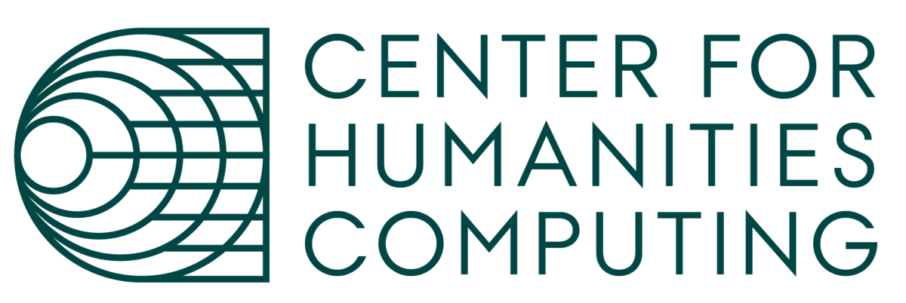
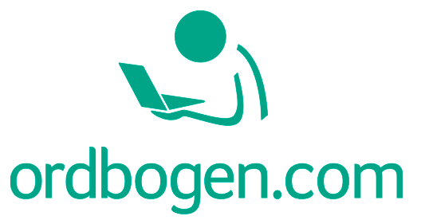
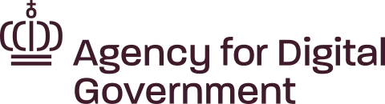

---
hide:
  - navigation
  - toc
---

  <h1>Building the Foundation of Danish AI</h1>
  
Language models have become critical infrastructure — but smaller languages like Danish risk being left behind. Danish Foundation Models is a collaborative effort across Danish universities and research institutions to develop, evaluate, and adapt open language AI that serves Danish society.

  

    National Initiative, International Reach
    Danish in focus — but our models, benchmarks, and tools contribute to the broader European and global open-source AI community.
  

  

    The Full AI Stack
    From training data and model development to evaluation benchmarks and real-world adaptation — we cover the entire pipeline.
  

  

    20+ Industry Use Cases
    Built in close partnership with Danish industry and public institutions to ensure the infrastructure is relevant where it matters.
  

  

    Open by Design
    All models, datasets, and research are freely available — enabling transparency, reproducibility, and broad access.
  

  

    
    
    
    
    
    <!-- Duplicated for now to make it seamless, but if we add more we don't need it -->
    
    
    
    
    
  

## Our Work

  <a class="story-card" href="https://huggingface.co/collections/danish-foundation-models/dynawords">
    Dynaword
    A continuously updated collection of Danish word resources and linguistic infrastructure, built to support the next generation of Danish NLP.
  </a>
  <a class="story-card" href="https://euroeval.com">
    Evaluation for European AI
    Through EuroEval and MTEB we develop and maintain evaluation benchmarks for both generative and search models — across Danish and other European languages.
  </a>
  <a class="story-card" href="https://github.com/centre-for-humanities-computing/danish-foundation-models">
    Open Source Contributions
    From deduplication pipelines to multilingual benchmarks — DFM contributes tools and datasets used well beyond the Danish language community.
  </a>
  <a class="story-card" href="./news/">
    Latest News
    Follow our work — from new model releases and dataset updates to research findings and community contributions.
  </a>

## Explore Our Resources

  <a class="resource-card" href="https://huggingface.co/danish-foundation-models">
    Models
    Browse and download all of our models on Hugging Face
  </a>
  <a class="resource-card" href="https://huggingface.co/datasets?search=danish-foundation-models">
    Datasets
    Explore the datasets we use to train and evaluate our models
  </a>

## Adoption and Collaboration

Real-world use is what makes AI infrastructure matter. The organisations below represent both active collaborators and adopters of DFM's work — spanning industry, public institutions, and cultural heritage. Their involvement shapes what we build and ensures it is relevant where it counts.

  

    
    
    
    
    <!-- Duplicated to make seamless loop -->
    
    
    
    
  

