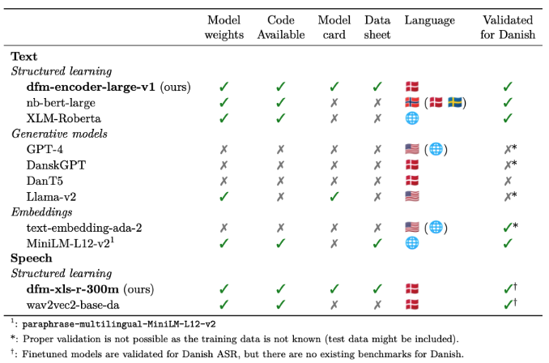
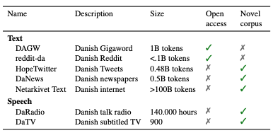

# Why Danish Needs Its Own Foundation Models

Danish is one of the world's richest languages — but in the age of large language models, it risks becoming a digital second-class citizen. We published a position paper arguing why that matters, and what we're doing about it.

<!-- more -->

The rise of large language models has been one of the most significant shifts in technology in recent years. But this revolution has not been neutral: it has overwhelmingly favoured English. Models like GPT-4 are trained primarily on English data, lack Danish-specific documentation, and have never been properly validated for Danish use. Meanwhile, the Danish-focused alternatives that exist are often closed, undocumented, or untested.

We think this is a problem worth taking seriously — not just for linguists, but for anyone who relies on digital infrastructure in Danish: public institutions, hospitals, courts, journalists, and businesses alike.

## The Landscape We Inherited

When we started this project, the landscape for Danish AI looked like this:

{ style="display: block; margin: 0 auto;" }

The picture is stark. Most available models — GPT-4, DanskGPT, DanT5 — have no publicly available weights, no model cards, no datasheets, and have never been properly validated for Danish. Our models, **dfm-encoder-large-v1** and **dfm-xls-r-300m**, were among the very few that ticked all the boxes: open weights, open code, full documentation, and validated for Danish.

## Data is the Foundation

Good models require good data. At the time of writing, the available Danish training data looked like this:

{ style="display: block; margin: 0 auto;" }

Several of the most important corpora — DaNews, DaTV — were not openly accessible. Part of our mission has been to change that: building new datasets, documenting existing ones, and making as much as possible available to the broader community.

## Our Argument

Our position is straightforward: smaller languages need deliberate, coordinated investment — from universities, public institutions, and industry — to avoid being left behind. Commercial incentives alone will not get us there. The Danish Foundation Models project is our attempt to build that infrastructure openly, document it rigorously, and make it available to everyone.

[Read the full paper on arXiv →](https://arxiv.org/abs/2311.07264)
