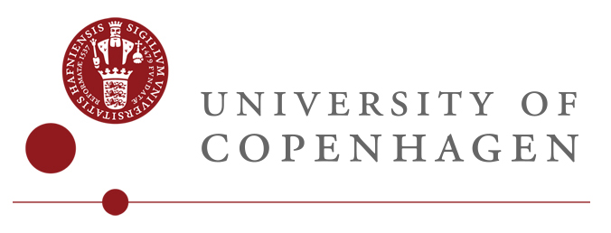
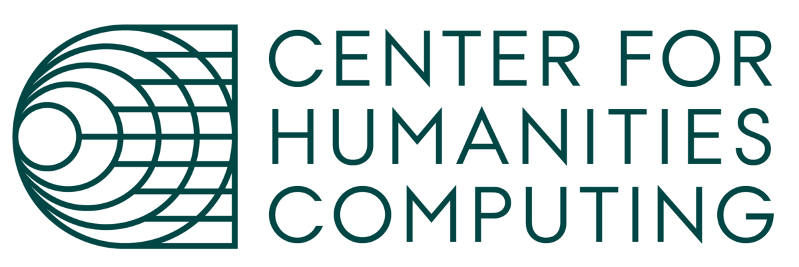

---
hide:
  - navigation
  - toc
  - footer
---

<section class="home-hero">
  <link rel="stylesheet" href="_static/home.css">
  

    

      <h1>Building the foundation of <em>Danish AI</em></h1>
      
Language models have become critical infrastructure — but smaller languages like Danish risk being left behind. Danish Foundation Models is a collaborative effort across Danish universities and research institutions to develop, evaluate, and adapt open language AI that serves Danish society.

      

        <a class="home-btn home-btn--primary" href="https://huggingface.co/danish-foundation-models/models">Explore models →</a>
        <a class="home-btn home-btn--ghost" href="https://huggingface.co/danish-foundation-models/datasets">Browse datasets</a>
      

      

      
<strong>20+</strong>industry use cases

      
<strong>100%</strong>open models and data

      

    

    

  

</section>

<section class="home-news">
  

    Latest
    News from DFM
    <a class="home-news__all" href="./news/index.html">All news →</a>
  

  

    <a class="home-news__item" href="./news/index.html">All news →</a>
  

</section>

  

    
    
    
    
    
    <!-- Duplicated for now to make it seamless, but if we add more we don't need it -->
    
    
    
    
    
  

## What we do

  

    
      <svg xmlns="http://www.w3.org/2000/svg" width="22" height="22" viewBox="0 0 24 24" fill="none" stroke="#c8102e" stroke-width="1.8" stroke-linecap="round" stroke-linejoin="round">
        <circle cx="12" cy="12" r="10"/>
        <line x1="2" y1="12" x2="22" y2="12"/>
        <path d="M12 2a15.3 15.3 0 0 1 4 10 15.3 15.3 0 0 1-4 10 15.3 15.3 0 0 1-4-10 15.3 15.3 0 0 1 4-10z"/>
      </svg>
    
    National initiative, international reach
    Danish in focus — but our models, benchmarks and tools contribute to the broader European and global open-source AI community, well beyond the Danish language.
  

  

    
      <svg xmlns="http://www.w3.org/2000/svg" width="22" height="22" viewBox="0 0 24 24" fill="none" stroke="#c8102e" stroke-width="1.8" stroke-linecap="round" stroke-linejoin="round">
        <rect x="2" y="3" width="6" height="6" rx="1"/>
        <rect x="9" y="3" width="6" height="6" rx="1"/>
        <rect x="16" y="3" width="6" height="6" rx="1"/>
        <rect x="2" y="12" width="6" height="6" rx="1"/>
        <rect x="9" y="12" width="6" height="6" rx="1"/>
        <rect x="16" y="12" width="6" height="6" rx="1"/>
      </svg>
    
    The full AI stack
    From training data and model development to evaluation and real-world adaptation. Through EuroEval and MTEB, Danish is represented in the most widely used benchmarks.
    <a class="pillar-link" href="https://euroeval.com">EuroEval →</a>
  

  

    
      <svg xmlns="http://www.w3.org/2000/svg" width="22" height="22" viewBox="0 0 24 24" fill="none" stroke="#c8102e" stroke-width="1.8" stroke-linecap="round" stroke-linejoin="round">
        <path d="M12 2a7 7 0 0 1 7 7c0 3-1.8 5.4-4.5 6.5V17a1 1 0 0 1-1 1h-3a1 1 0 0 1-1-1v-1.5C6.8 14.4 5 12 5 9a7 7 0 0 1 7-7z"/>
        <line x1="9" y1="21" x2="15" y2="21"/>
        <line x1="10" y1="18" x2="14" y2="18"/>
      </svg>
    
    Built with industry
    Developed in close partnership with Danish companies and public institutions, so the infrastructure is relevant where it matters.
  

  

    
      <svg xmlns="http://www.w3.org/2000/svg" width="22" height="22" viewBox="0 0 24 24" fill="none" stroke="#c8102e" stroke-width="1.8" stroke-linecap="round" stroke-linejoin="round">
        <path d="M2 3h6a4 4 0 0 1 4 4v14a3 3 0 0 0-3-3H2z"/>
        <path d="M22 3h-6a4 4 0 0 0-4 4v14a3 3 0 0 1 3-3h7z"/>
      </svg>
    
    Open by design
    All models, datasets and research are freely available. Dynaword lets municipalities, industry and research contribute to shared, openly licensed data.
    <a class="pillar-link" href="https://huggingface.co/collections/danish-foundation-models/dynawords">Dynaword →</a>
  

## Our Network

DFM is a consortium of four Danish institutions working with partners across Denmark, the Nordics and Europe — from public institutions and industry to research projects building open language models for their own languages. Their involvement shapes what we build and ensures it is relevant where it counts.

<figure class="home-map">
  

    <svg data-dfm-map viewBox="0 0 1560 1030" role="img" aria-label="Map of DFM's partners in Denmark and collaborators across the Nordics and Europe"></svg>
  

</figure>

