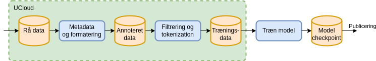
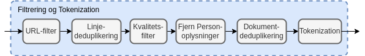

# Data Handling

Training large language models requires enormous amounts of data. From the moment we receive raw data to the point it can be used for model training, it goes through a transformation process.

The following is a high-level description of this process. We continuously develop and improve it to ensure we apply state-of-the-art methods and practices.

<!-- more -->

## Secure Handling

In Danish Foundation Models we use the Danish e-infrastructure Consortium [DeiC](https://www.deic.dk/da/om-deic) and [UCloud](https://docs.cloud.sdu.dk/intro/security.html) for data management. The UCloud platform is [ISO 27001](https://www.iso.org/standard/27001) certified — a globally recognised standard ensuring our data handling practices meet strict international criteria. For more information on our security measures, see UCloud's [security documentation](https://docs.cloud.sdu.dk/intro/security.html).

## Data Preparation

All data preparation takes place on UCloud. The figure below shows the process all data must go through before being used for model training. The raw data is retained in its original form on UCloud and then annotated with metadata.

This dataset is transferred to a GPU-accelerated supercomputer via a secure connection, after which model training begins. During training, multiple checkpoints of model weights are saved. These checkpoints are published together with the model code and used to run the model. The three processes are described in detail below.



## Metadata and Formatting

The raw data is annotated with two types of metadata. The first is a datasheet (in Markdown, similar to [HuggingFace dataset cards](https://huggingface.co/docs/hub/en/datasets-cards)) that summarises the entire dataset and describes its provenance and license. Part of an example datasheet is shown below. The first section uses a machine-readable format enabling automatic dataset selection from a larger collection. The remainder provides a free-text description of the dataset.

```markdown
---
pretty_name:  Scrape from Hovedstaden
language:
  - da
license: cc0-1.0
license_name: Creative Commons Zero v1.0 Universal
size_categories:
  - 10K<n<100K
task_categories:
  - text-generation
  - fill-mask
task_ids:
  - language-modeling
---
# Dataset Card for scape_hovedstaden
## Dataset Description
- **Number of records:** 24752
- **Languages:** Danish
```

The second type is per-document metadata describing which dataset the document belongs to, its origin, when it was added, and other metadata such as the source URL. Per-document metadata is stored alongside the document in a standardised JSONL format. An example document with metadata from the "Scrape from Hovedstaden" dataset is shown below. This metadata follows the document throughout the entire processing pipeline, making it possible to trace documents back to their source. A script for converting raw data into the standardised format is maintained for each raw dataset.

```yaml
{
    'id': 'doc_hovedstaden_Rigshospitalet_...',
    'text': 'Transkraniel Doppler - NIA 6021\n\nMålgrupper og anv...',
    'source': 'scrape_hovedstaden',
    'added': '2024-05-23',
    'created': '2023-11-16, 2024-04-04',
    'metadata': {
        'subject': 'health',
        'language': 'danish',
        'organization': 'The Danish Agency for Digitalisation',
        'source-pretty': 'University of Southern Denmark (SDU) & Capital Region',
        'URL': 'https://sprogteknologi.dk/dataset/...'
    }
}
```

## Filtering

The standardised format enables uniform processing of documents. The individual filtering steps fall into the following categories:

- URL filtering (web data only)
- Line deduplication
- Quality filtering
- Removal of personal data
- Document deduplication

Each step is described below. After filtering, text data is tokenised — converted into a binary format readable by the model.



### URL Filtering

Data from public websites that include a URL as metadata is first processed by a URL filter.

For all domains in the dataset, the domain's `robots.txt` and `ai.txt` are fetched periodically. If these disallow CommonCrawl or other language-model crawlers, the domain is added to a blocklist and documents from those domains are filtered out — even if the pages were fetched at a time when crawling was permitted.

We also apply blocklists from publicly available databases of harmful content, using [datatrove's built-in filter](https://github.com/huggingface/datatrove/blob/main/src/datatrove/pipeline/filters/url_filter.py) and [Dolma's blocklist collection](https://github.com/allenai/dolma/blob/main/python/dolma/taggers/url.py). These cover categories including pornography, phishing, advertising, criminal sites, abuse, fraud, malware, piracy, ransomware, scams, redirects, crypto, drugs, gambling, vaping, and social networks.

### Deduplication

Deduplication removes repetitions in training data, which can distort model behaviour. We apply two types: line deduplication and document deduplication.

Line deduplication removes repeated lines across documents — particularly useful for web data where cookie notices and navigation menus appear on many pages. This is implemented efficiently using a Bloom filter. Some dataset types, such as legal documents with standard formulations, may be exempted.

Document deduplication compares all documents across the cleaned corpus and groups those that are sufficiently similar into clusters, retaining one document per cluster. This prevents certain documents from being overrepresented in the final dataset.

### Quality Filtering

Web data can contain a great deal of noise — fragments of HTML, other code, and incomplete sentences. We apply heuristics based on statistics for normal text to catch low-quality documents. Currently we use the same filters as Gopher and C4, and we are also exploring perplexity-based and other filtering approaches.

### Personal Data

When a model is trained on data containing personal information, there is a risk the model may reproduce that information. Where possible, such data is detected and replaced with generic substitutes of the same type. Examples include names, email addresses, phone numbers, and national ID numbers.

A key challenge is that neither human nor automated removal of personal data is 100% accurate, so datasets that avoid such information are preferable.

## Dialogue about Data

We have the utmost respect for those who own data. We understand how important it is to protect and honour data owners' wishes regarding what their data may be used for.

If you have any questions about the data we use, please do not hesitate to contact us. We are very open to dialogue and value your input, as it helps us improve our practices and ensure we meet data owners' expectations.
