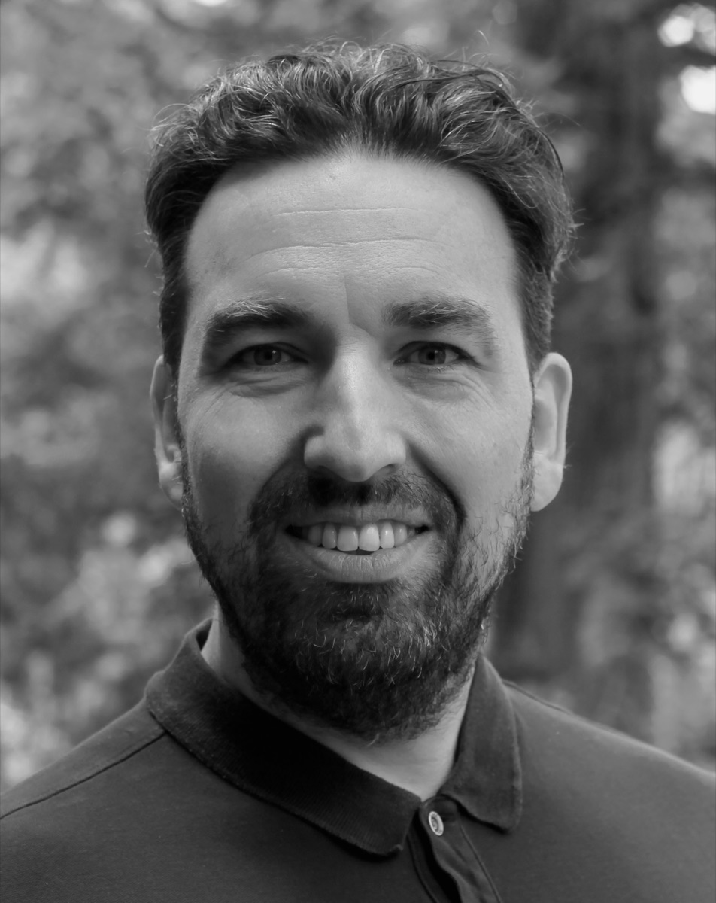

# Peter wants to teach the machine to think – a new, clever model has brought DFM a step closer

DFM researcher Peter Schneider-Kamp has spent 30 years automating the human thought process. With the new model, Mimir, he and DFM have come a step closer. The model is the means. The goal is Danish sovereignty and human creativity.

<!-- more -->

---

<figure style="float: right; margin: 0 0 1.5rem 2rem; max-width: 280px;">
  
</figure>

There was a moment in the 1990s when the computer began to do something it should not have been able to do. It played chess. Well enough to beat grandmaster Garry Kasparov. And certainly well enough for a young man in Germany to make a choice that would consume him for the next 30 years.

"I chose to become a computer scientist in the '90s because I could see that AI could be used to automate human thought processes. I wanted to be part of that," says Peter Schneider-Kamp from his office in Odense.

The professor from the University of Southern Denmark (SDU) built his first neural networks at the computer science departments in Aachen and Trondheim. And when deep learning and big data gained new momentum in 2018, he intensified his work.

"The goal has always been to automate the human thought process, so computers can solve tasks the way a human solves them. I believe that if we have systems that can do research at a human level, we start to have a chance against, for example, cancer. Every type of cancer needs a different kind of treatment. Perhaps we can solve that with AI," he says, and continues:

"If we can get the machine to make sure we are healthy and have bread on the table, then we humans can spend our time on what is exciting. We already live in a world with more resources than necessary, but the distribution is very unequal. I hope AI can give us a better distribution of resources."

## The small revelation

In August 2026, Peter Schneider-Kamp came a step closer to his grand vision with the language model Mimir. A mere one billion parameters, trained in three weeks on eight GPUs in the basement at SDU. It does not immediately sound like a recipe for success when frontier models are up to a thousand times larger.

No one had foreseen that the model would attract international attention in developer circles and be downloaded more than 8,000 times in a month. Or that Peter Schneider-Kamp would be answering daily enquiries from foreign developers and researchers who wanted to collaborate.

Mimir was born out of an idea the professor had held for a long time. The new HRM architecture had shown that small models can be trained to reason without enormous amounts of data and compute. During training, Mimir had not only learned to perform complicated probability calculations. It had also been forced to answer thousands of questions and learn from them. It was designed to think for itself.

"The first wild-west phase of scaling models is coming to an end. It has become more important that we use resources better. We can go a very long way with the resources we already have. And even further if we get more," says Peter Schneider-Kamp.

Still, he was unsure whether the model would be able to write properly. But when the team ran the model through the required benchmarks, Peter had to set aside his innate German modesty.

"Wow, it exceeded all expectations."

## A clever model that thinks more than it knows

With the release of Mimir, 30 years of work fell into place with a model that can think without knowing everything. It writes fluently in Danish and English. It can keep a conversation going and make up a story about Donald Duck as an astronaut. On EuroEval's benchmarks, Mimir performs on par with models that are many times larger and require far more resources.

"It doesn't have a huge amount of general knowledge, because it isn't trained on the entire internet. But it is quite intelligent. I would actually say it is clever. It can think and reason, and that is above the level I expected we could reach," says Peter Schneider-Kamp.

Mimir is the latest in a long line of upcoming models from Danish Foundation Models. That is why Peter Schneider-Kamp is keen to point out that the result did not come out of the blue, but was achieved because of the establishment of DFM.

"We have spent two years creating the data Mimir is built on, and that is why we are getting results now. We have built up competencies and ecosystems, so we have the capacity to build these models. Now we know what we need to do. And it will go even faster from here."

In Odense alone there are ten PhD students and two postdocs. And DFM as a group has become one of the major players in Europe, with publications at the leading international conferences.

"It is very important that we build an ecosystem across the regions of the country. No one talked about Danish models before, and now we have put Denmark on the European map. We could not have done that without DFM," says the professor.

## What a country gains from building its own

The paradox is that the work is earning recognition around the world, while it is precisely the world's indifference that makes DFM necessary. No one other than Danish researchers is going to build AI models for a small language like Danish. Danish-developed AI can safeguard Danish values and language, while also becoming a strength for Danish companies, hospitals, and public authorities.

"We have proven that you don't need a data centre to automate human thought processes. It can be done on a computer. And so it is not necessary to send data out of Denmark all the time and risk others gaining access to or ownership of it. And what happens if Trump switches off AI in Europe? Should we then buy AI from the Chinese? No, we need to be able to do it ourselves," says Peter Schneider-Kamp.

According to the professor, the timing is favourable right now. The phase in which victory went to whoever had the most data and GPUs is coming to an end. But if we are to realise the full value of Danish AI, we must work together across Europe.

"If we are to get as far as China, we need to collaborate across Europe, because we need more hands and brains. If we join forces, I am confident we can build European models that are right at the forefront."

That is also why he believes the work in DFM must be developed and expanded.

"In two years, DFM could have the best European models — safe, legal, and truly competitive. But that damn well requires DFM to continue," concludes Peter Schneider-Kamp.

---

*Danish Foundation Models is part of the Danish government's strategic AI initiative. The goal is to train, align, evaluate, maintain, and provide open access to large Danish language models. The project is a collaboration between Aarhus University, the University of Southern Denmark, the University of Copenhagen, and the Alexandra Institute. [Read more about DFM here](https://danish-foundation-models.github.io/site/).*
